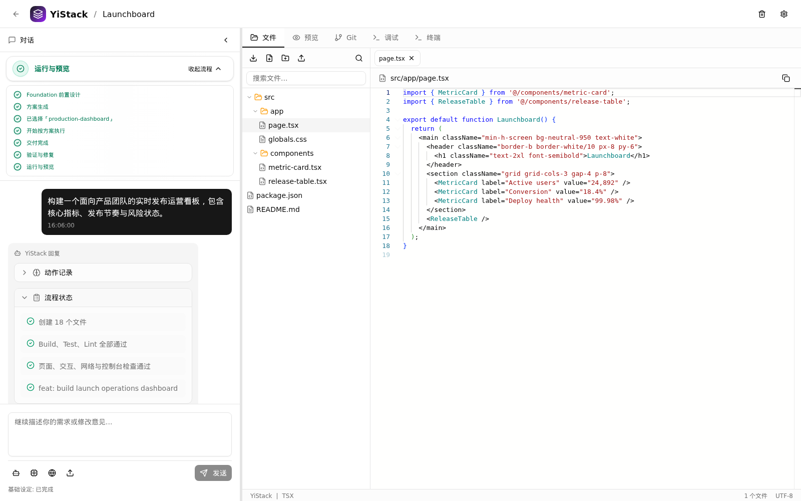
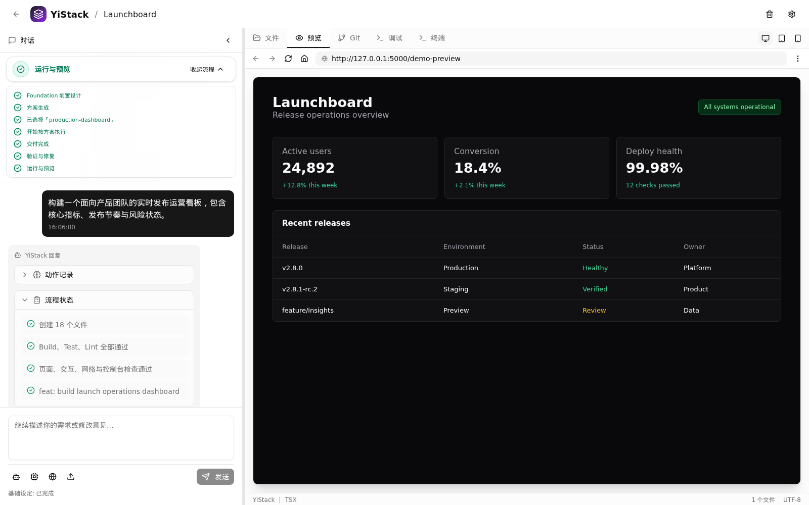
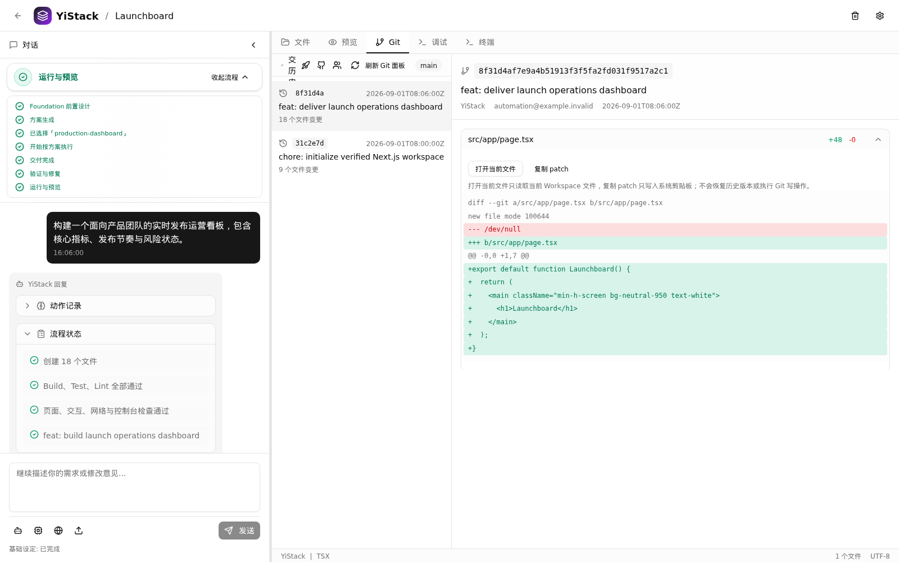

# YiStack

[简体中文](README.md) | [**English**](README.en.md)

**One prompt to a complete application: from natural-language requirements to
a runnable, verified, and evolvable full-stack delivery.**

YiStack is a high-performance, open-source AI application generation platform
for developers and small teams, driven by the **YES Engineering System**. Its
Go backend, isolated Workspaces, and durable jobs connect requirements and
visual references, solution approval, full-stack code generation, project-level
validation, bounded automatic repair, container execution, browser acceptance,
and Git delivery into a truthful, traceable, and recoverable engineering loop.

> Current release: **v1.0.0**, YiStack's first stable open-source release. Its
> stability scope is limited to the capabilities documented in this README and
> [`docs/PRODUCT.en.md`](docs/PRODUCT.en.md). Only clean database installation
> is guaranteed; arbitrary in-place upgrades from historical versions are not.

## Why YiStack

| Advantage | What it delivers |
| --- | --- |
| One prompt to a complete application | Starts with a natural-language requirement or reference image and connects Foundation, planning, implementation, validation, preview, and Git delivery instead of stopping at code snippets |
| YES Engineering System | Governs human and AI development through Specification, Execution, and Validation; protocol, authorization, or validation failures cannot be reported as success |
| Real project-level validation | Runs stack-aware build/test/lint inside the generated project, applies bounded repair, and validates the result in a browser |
| High-performance isolated runtime | Uses a Go backend for orchestration and streaming events, with every project running in an isolated rootless Podman Workspace |
| Durable and recoverable execution | Generation Jobs, attempts, leases, and SSE replay preserve state across refreshes, disconnects, and process interruptions |
| Visual context and live collaboration | Converts references into trusted `visual_context.v1`; shared workspaces add roles, presence, remote synchronization, and SHA-256 conflict protection |
| User-owned source and delivery | Monaco, terminal, Git, GitHub synchronization, version recovery, and export keep generated source under user control |

## Product Preview



<p align="center">One workspace from requirements and engineering execution to verified, reviewable source code</p>

<table>
  <tr>
    <td width="50%"></td>
    <td width="50%"></td>
  </tr>
  <tr>
    <td align="center">Live runtime preview and browser acceptance</td>
    <td align="center">Git commits, file diffs, and delivery traceability</td>
  </tr>
</table>

> Screenshots are captured from the real YiStack interface with a sanitized demo project and deterministic demo data.

## Current Capabilities

| Capability | Status | Boundary |
| --- | --- | --- |
| Foundation and solution decisions | Implemented | Produces a structured Foundation and candidate technical plans from requirements, then waits for user approval before implementation |
| Visual context | Implemented | PNG/JPEG upload or paste, real multimodal analysis, HMAC integrity proof, and end-to-end `visual_context.v1` binding |
| Structured application generation | Implemented | LLM output uses a versioned schema; failures cannot be reported as success |
| Project quality gate | Implemented | Runs stack-aware build/test/lint checks with bounded automatic repair |
| Durable Generation Jobs | Implemented | Supports job state, attempts, SSE replay, and terminal-state recovery |
| Isolated runtime and preview | Implemented | Uses rootless Podman and includes browser acceptance contracts |
| Supabase application preset | Implemented | Generates Auth, RLS, private Storage, migrations/rollback, and type boundaries |
| GitHub import and synchronization | Implemented | OAuth PKCE, encrypted tokens, conflict blocking, safe push, and idempotent webhooks |
| Vercel deployment adapter | Implemented; live acceptance pending | Publish, domain, log, and rollback behavior has automated coverage; the real lifecycle still requires external credentials |
| Shared-workspace collaboration | Implemented | Owner/editor/viewer roles, durable presence, SSE replay, remote file synchronization, append-only auditing, and SHA-256 CAS |
| Official templates | Implemented | Persistent versions, SHA-256 verification, and CAS publish/rollback; not a community marketplace |
| Plugin system and template marketplace | Not implemented | Planned for a later phase |
| Commercial editions, SSO, Kubernetes, and SLA | Not released | Product assumptions, not commitments of the current open-source version |

Public changes are recorded in
[`docs/CHANGELOG.en.md`](docs/CHANGELOG.en.md). Product direction is defined by
[`docs/PRODUCT.en.md`](docs/PRODUCT.en.md) and
[`docs/roadmap/ROADMAP.en.md`](docs/roadmap/ROADMAP.en.md). Implementation
status must be verified by executable gates.

## YES Engineering System

YES (YiStack Engineering Specification) is YiStack's engineering specification
and execution kernel, not a prompt template. Its five layers distinguish
"code was generated" from "software is ready to deliver":

1. **Entry** defines the common entry point, context-reading order, and hard constraints.
2. **Principle** defines truthfulness, security, user control, and engineering priorities.
3. **Architecture** governs module boundaries, call direction, state ownership, and data ownership.
4. **Execution** defines the continuous protocol from clarification and planning through implementation, validation, and delivery.
5. **Validation** supplies executable evidence through `pnpm yes:validate`, project-level build/test/lint, database checks, security audits, and browser acceptance.

YES prevents YiStack from treating a file write or model response as success.
Protocol, authorization, build, test, runtime, or browser-acceptance failures
must block the workflow, record the cause, and expose a recovery path.

See [YES Engineering System](docs/engineering/YES.en.md) for its complete
definition, current boundary, and evolution path.

## Technology Stack

- Frontend: Next.js 16, React 19, TypeScript 5.9, Tailwind CSS 4, Monaco Editor
- Backend: Go 1.26.6+, Hertz, GORM
- Database: Supabase/PostgreSQL
- Runtime: rootless Podman
- Package manager: pnpm 11.5.2

## Official Prebuilt Package Requirements

YiStack's web interface is accessible from modern browsers across platforms, and generated project source is not tied to the client operating system. The current official prebuilt server packages provide Linux `amd64` and `arm64` builds, with Debian 12 as the fully validated production baseline. Compatible Ubuntu environments with `apt`, systemd, and rootless Podman may also use the installer, but Windows and macOS server deployments are not currently production-validated. Installation requires root privileges and network access to system package repositories, Playwright browser downloads, and container registries. Node.js 22 is bundled; production hosts do not need Go, pnpm, or frontend build tools.

## Production Quick Start

Download the deployment archive and matching `.sha256` file from [GitHub Releases](https://github.com/NHPT/YiStack/releases), for example:

```text
yistack-vX.Y.Z-linux-amd64.tar.gz
yistack-vX.Y.Z-linux-amd64.tar.gz.sha256
```

Verify, extract, and install the package:

```bash
sha256sum --check yistack-vX.Y.Z-linux-amd64.tar.gz.sha256
tar -xzf yistack-vX.Y.Z-linux-amd64.tar.gz
cd yistack-vX.Y.Z-linux-amd64
sudo ./install.sh
```

The installer verifies the internal `MANIFEST.sha256`, creates the `yistack` system user, configures rootless Podman, installs the systemd units and Playwright Chromium, and uses these stable paths:

```text
/opt/yistack/current   active release
/etc/yistack           configuration
/var/lib/yistack       projects, container data, and browser runtime
/var/log/yistack       logs
/var/cache/yistack     caches
```

### External Supabase

1. Apply `database/init.sql` from the extracted package to a new Supabase project.
2. Edit `/etc/yistack/yistack.env` and configure at least `SUPABASE_URL`, `SUPABASE_ANON_KEY`, `SUPABASE_SERVICE_ROLE_KEY`, and `SUPABASE_DB_PASSWORD`. Full functionality requires the direct database password.
3. Configure `CORS_ALLOWED_ORIGINS`, public callback URLs, and any other deployment secrets.
4. Start and verify the services:

```bash
sudo systemctl start yistack.target
sudo yistackctl health
sudo yistackctl status
```

### PostgreSQL 16 Container

To run the YiStack control-plane database without Supabase, let the installer create a rootless PostgreSQL 16 Podman container with CPU, memory, and process limits:

```bash
sudo ./install.sh --with-postgres --start
sudo yistackctl postgres status
sudo yistackctl health
```

The installer generates the database password in `/etc/yistack/postgres.env`, then applies the Supabase SQL compatibility layer and `database/init.sql`. This mode provides YiStack's own PostgreSQL database and traditional JWT authentication. It does not provide Supabase Auth, Storage, or other managed services; generated applications that depend on Supabase still need a separate Supabase project.

### Optional Ephemeral Trial Mode

A public trial instance can enable ephemeral trial mode on the standard PostgreSQL production deployment without maintaining a separate application branch. It behaves like a scheduled restore sandbox: data remains persisted during a visitor's session and is deleted at the next scheduled reset. It is therefore not an immediate browser-style private mode, and visitors should not enter secrets or other sensitive data.

This mode supports only the installer-managed local PostgreSQL database and fails closed when external Supabase is configured, avoiding partial or irreversible resets of an external database. Configure administrators, providers, and system policy first, verify that no regular users or projects exist, then install the configuration and capture a clean baseline:

```bash
sudo install -m 0640 -o root -g yistack \
  /opt/yistack/current/config/yistack-demo-maintenance.env.example \
  /etc/yistack/demo-maintenance.env
sudo sed -i 's/^DEMO_MAINTENANCE_ENABLED=false$/DEMO_MAINTENANCE_ENABLED=true/' \
  /etc/yistack/demo-maintenance.env
sudo yistackctl demo snapshot
sudo yistackctl demo apply-schedule
sudo yistackctl demo status
```

`snapshot` briefly stops the application and project containers, then records a PostgreSQL dump, an empty project workspace, the Release commit, and SHA-256 checksums. It refuses to create a baseline when regular users, projects, related business records, or project workspaces still exist. It does not copy secrets from `/etc/yistack`.

The defaults are:

- restore the clean baseline after 04:00 each day, with up to 10 minutes of randomized delay;
- on every daily reset, remove all regular users and related database records, project workspaces, containers and networks labeled with `yistack.project_id`, container state, generation evidence, caches, and managed file logs;
- use hourly TTL cleanup for expired projects, stopped project containers, generation evidence, caches, and logs as capacity protection between daily resets;
- when disk usage reaches 80%, remove the oldest projects until usage reaches 70%;
- always retain Podman base images, `runtime/templates`, `ms-playwright`, administrator and provider configuration, configuration files, and installed Releases;
- never run a global `podman system prune` or delete reusable images.

The reset time, randomized delay, hourly cleanup time, TTLs, and disk watermarks are configurable in `/etc/yistack/demo-maintenance.env`. For example:

```bash
DEMO_RESET_ON_CALENDAR="*-*-* 04:00:00"
DEMO_RESET_RANDOMIZED_DELAY_SEC=10min
DEMO_CLEANUP_ON_CALENDAR="*-*-* *:30:00"
DEMO_CLEANUP_RANDOMIZED_DELAY_SEC=5min
```

Calendar expressions use systemd syntax and the server timezone. After changing them, run `sudo yistackctl demo apply-schedule` to validate the values and atomically update the timer overrides. After upgrading YiStack, an old baseline is rejected when its schema or `SOURCE_COMMIT` no longer matches; capture a new baseline only after validating the new release and confirming that no regular users or projects exist. Manual operations and timer shutdown are available through:

```bash
sudo yistackctl demo cleanup
sudo yistackctl demo reset
sudo systemctl list-timers 'yistack-demo-*'
sudo systemctl disable --now \
  yistack-demo-reset.timer \
  yistack-demo-cleanup.timer
```

The frontend listens on `127.0.0.1:5000` and the backend on `127.0.0.1:8080` by default. Put Caddy, Nginx, or an equivalent TLS reverse proxy in front of the frontend for public deployments. After editing `/etc/yistack/yistack.env`, run:

```bash
sudo yistackctl restart
sudo yistackctl logs
```

Each Release includes amd64/arm64 deployment archives, per-archive SHA-256 files, a combined `SHA256SUMS`, SPDX JSON SBOMs, and GitHub build provenance. The tag workflow creates or updates a Release only after the full quality gate and packaged-runtime acceptance pass.

`database/init.sql` remains the clean-install schema source for v1.0.0. It creates the provider catalog but enables no LLM provider by default. Configure and preflight at least one provider in the admin console after startup. Never commit API keys or include them in deployment archives.

## Source Development

Source development requires the following tools; production deployment does not.

| Tool | Supported baseline |
| --- | --- |
| Node.js | 22.x |
| pnpm | 11.5.2 |
| Go | 1.26.6 or a newer 1.x release |
| Podman | 3.4+, rootless |
| Database | Supabase, or PostgreSQL 15+ for SQL verification |

```bash
git clone https://github.com/NHPT/YiStack.git
cd YiStack
corepack enable
pnpm install --frozen-lockfile
(cd backend && go mod download)
cp .env.example .env
```

Apply `backend/init.sql` to the development database, finish configuring `.env`, and start the development environment:

```bash
bash scripts/dev.sh
```

Default endpoints:

- Frontend: <http://localhost:5000>
- Backend API: <http://localhost:8080/api>

The repository does not publish test credentials suitable for deployment. Seed credentials in `backend/init.sql` are only for local initialization and must be changed immediately in any shared or production environment.

## Validation

Run the baseline gates:

```bash
pnpm lint
pnpm build
pnpm yes:validate
(cd backend && go test ./...)
pnpm eval:smoke:ci
git diff --check
```

Verify a clean checkout, toolchain, rootless Podman, Supabase SQL baseline, and
minimum provider catalog:

```bash
bash scripts/verify-clean-checkout.sh
```

`pnpm eval:smoke:ci` is a deterministic canonical benchmark contract smoke test
that requires no external credentials. A live model smoke test requires a
running YiStack instance and explicit credentials:

```bash
YISTACK_EVAL_TOKEN=... \
YISTACK_EVAL_PROVIDER=... \
YISTACK_EVAL_MODEL=... \
pnpm eval:smoke
```

## Database Upgrade Boundary

v1.0.0 guarantees only clean installation through `backend/init.sql`.
Baselines, future migration naming, compatibility scope, and rollback
requirements are documented in
[`docs/engineering/DATABASE_LIFECYCLE.en.md`](docs/engineering/DATABASE_LIFECYCLE.en.md).
YiStack does not claim support for upgrading arbitrary existing databases until
the migration runner and compatibility matrix are complete.

## Repository Layout

```text
backend/       Go API, services, repositories, and database initialization
src/           Next.js application, pages, and API proxies
scripts/       Build scripts, engineering gates, benchmarks, and environment checks
evals/         Canonical prompts and executable fixtures
docs/          Architecture, engineering rules, public roadmap, and changelog
runtime/       Local workspaces and evidence; excluded from source review
.github/       CI, CODEOWNERS, issue templates, and pull request templates
```

## Documentation

- [Developer Guide](docs/DEVELOPER_GUIDE.en.md)
- [Architecture](docs/ARCHITECTURE.en.md)
- [Product Boundaries](docs/PRODUCT.en.md)
- [YES Engineering System](docs/engineering/YES.en.md)
- [Engineering Principles](docs/engineering/PRINCIPLES.en.md)
- [Development Workflow](docs/engineering/DEVELOPMENT_WORKFLOW.en.md)
- [Database Lifecycle](docs/engineering/DATABASE_LIFECYCLE.en.md)
- [Public Roadmap](docs/roadmap/ROADMAP.en.md)
- [Changelog](docs/CHANGELOG.en.md)

## Contributing

Before opening an issue or pull request, read:

- [Contributing Guide](CONTRIBUTING.en.md)
- [Security Policy](SECURITY.md)
- [Code of Conduct](CODE_OF_CONDUCT.md)
- [Governance](GOVERNANCE.md)
- [Maintainers](MAINTAINERS.md)

Security issues must be reported privately through the channel defined in
[`SECURITY.md`](SECURITY.md), not through a public issue.

## License

YiStack is licensed under the [Apache License 2.0](LICENSE).
