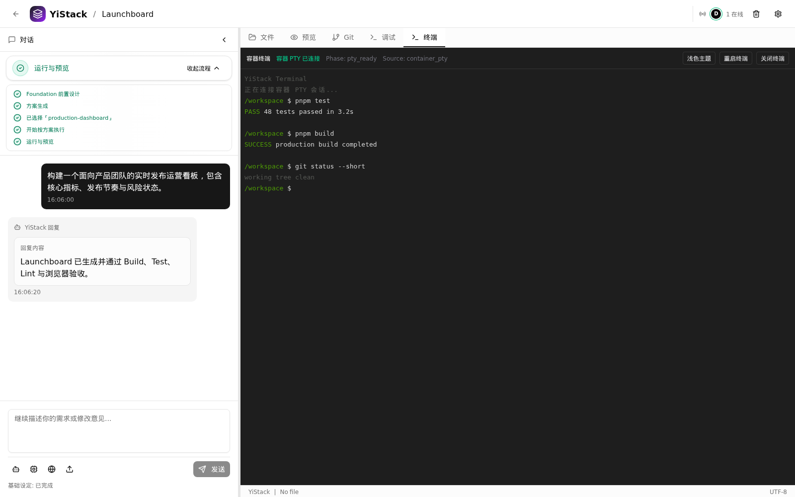
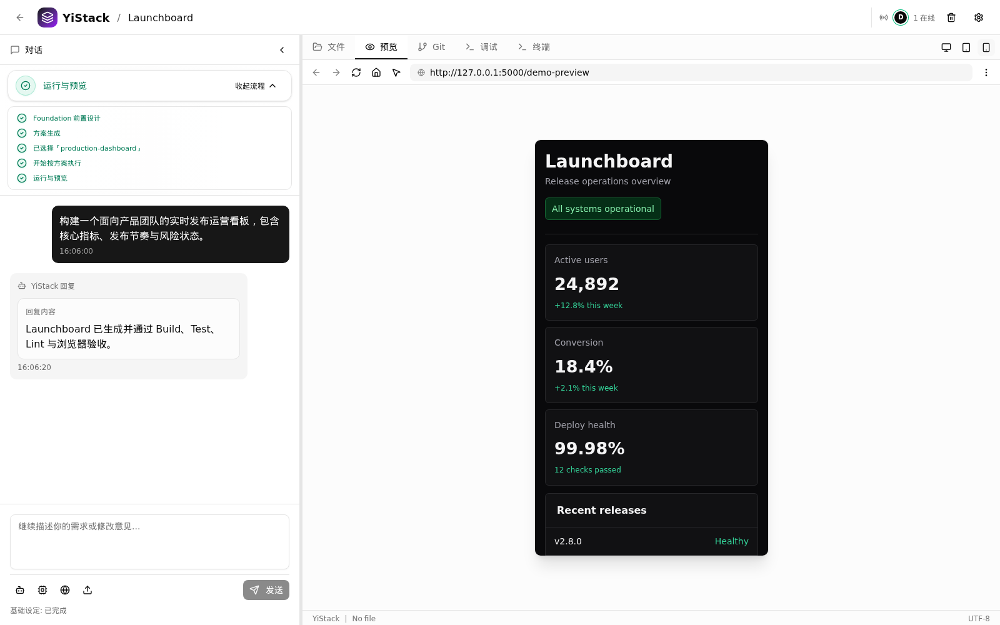

# YiStack 一栈

[**简体中文**](README.md) | [English](README.en.md)

**一句话生成完整应用：从自然语言需求到可运行、可验证、可迭代的全栈交付。**

YiStack 是由 **YES Engineering System** 驱动、面向开发者和小型团队的开源高性能 AI 应用生成平台。它以 Go 后端、独立 Workspace 和持久任务为基础，将需求与参考图、方案确认、全栈代码生成、项目级验证、有限自动修复、容器运行、浏览器验收和 Git 交付组织成一条真实、可追踪、可恢复的工程闭环。

> 当前版本：**v1.1.6**。这是 v1.1 系列的部署可观测性与结果判定修复版本：安装和服务启动会自动等待健康检查，rootless Podman 使用隔离的服务用户环境，安装、升级、卸载和维护均支持从 `/root` 等受限目录执行；稳定范围以本 README 和 [`docs/PRODUCT.md`](docs/PRODUCT.md) 声明的能力边界为准。全新安装使用当前 Release 的 `database/init.sql`，存量安装使用一键升级命令。

## 核心优势

| 特点 | 用户获得的能力 |
| --- | --- |
| 一句话到完整应用 | 从自然语言需求或参考图开始，贯通 Foundation、方案、实现、验证、预览和 Git 交付，而不只生成代码片段 |
| YES 工程体系 | 用 Specification、Execution 和 Validation 约束 AI 与人工开发；协议、权限或验证失败时拒绝伪成功 |
| 真实项目级验证 | 在生成项目中运行 stack-aware build/test/lint，失败后执行有限自动修复，并通过浏览器验收最终结果 |
| 高性能隔离运行 | Go 后端承载编排与流式事件，每个项目运行在独立 rootless Podman Workspace 中 |
| 持久且可恢复 | Generation Job、attempt、lease 和 SSE replay 共同保证刷新、断线或进程中断后的状态恢复 |
| 视觉与实时协作 | 参考图转为可信 `visual_context.v1`；共享工作区提供角色权限、presence、远端同步和 SHA-256 冲突保护 |
| 源码与交付可控 | Monaco、终端、Git、GitHub 同步、版本恢复和导出能力让生成代码始终归用户管理 |

## 产品预览


<p align="center">从需求、工程执行和质量门禁到可审阅源码的统一工作台</p>

<table>
  <tr>
    <td width="50%"></td>
    <td width="50%"></td>
  </tr>
  <tr>
    <td align="center">真实运行预览与浏览器验收</td>
    <td align="center">Git 提交、文件差异与交付追踪</td>
  </tr>
  <tr>
    <td width="50%"></td>
    <td width="50%"></td>
  </tr>
  <tr>
    <td align="center">项目容器终端与真实命令输出</td>
    <td align="center">Preview 桌面、平板与移动端视口切换</td>
  </tr>
</table>

> 截图来自真实 YiStack 界面，使用脱敏演示项目和确定性演示数据；可通过 `pnpm docs:screenshots` 重新生成终端和移动端 Preview 截图。

## 当前能力

| 能力 | 状态 | 边界 |
| --- | --- | --- |
| Foundation 与方案决策 | 已实现 | 从需求约束生成结构化 Foundation 和候选技术方案，经用户确认后进入实现 |
| 视觉上下文 | 已实现 | PNG/JPEG 上传或粘贴、真实多模态分析、HMAC 完整性证明和 `visual_context.v1` 全链路绑定 |
| 结构化应用生成 | 已实现 | LLM 输出使用版本化 Schema，失败不能伪装成成功 |
| 项目质量门禁 | 已实现 | 按项目技术栈运行 build/test/lint，支持有限自动修复 |
| 持久 Generation Job | 已实现 | 支持任务状态、attempt、SSE replay 和终态恢复 |
| 独立运行环境与预览 | 已实现 | 使用 rootless Podman，包含浏览器验收契约 |
| Supabase 应用预设 | 已实现 | 生成 Auth、RLS、私有 Storage、migration/rollback 和类型边界 |
| GitHub 导入与同步 | 已实现 | OAuth PKCE、加密 token、冲突阻断、安全 push 和 webhook 幂等 |
| Vercel 部署适配器 | 已实现，待云端验收 | 发布、域名、日志和回滚逻辑已有自动化测试；真实 lifecycle 仍需外部凭据验收 |
| 共享工作区协作 | 已实现 | owner/editor/viewer、持久 presence、SSE 重放、远端文件同步、append-only 审计和 SHA-256 CAS |
| 官方模板 | 已实现 | 持久版本、SHA-256、CAS 发布/回滚；当前不是社区模板市场 |
| 插件系统与模板市场 | 未实现 | 仍属后续规划 |
| 商业版本、SSO、K8s、SLA | 未发布 | 产品假设，不是当前开源版本承诺 |

公开变更以 [`docs/CHANGELOG.md`](docs/CHANGELOG.md) 记录，产品方向以
[`docs/PRODUCT.md`](docs/PRODUCT.md) 和
[`docs/roadmap/ROADMAP.md`](docs/roadmap/ROADMAP.md) 为准；实现状态必须由
可执行门禁验证。

## YES 工程体系

YES（YiStack Engineering Specification）是 YiStack 的工程规范与执行内核，不是一个提示词模板。它用五层结构把“生成了代码”和“完成了可交付软件”区分开：

1. **Entry**：统一入口、上下文读取顺序和硬约束。
2. **Principle**：定义真实性、安全性、用户控制权和工程价值排序。
3. **Architecture**：约束模块边界、调用方向、状态职责和数据所有权。
4. **Execution**：规定需求澄清、方案、实现、验证和交付的连续执行协议。
5. **Validation**：通过 `pnpm yes:validate`、项目级 build/test/lint、数据库检查、安全审计和浏览器验收提供可执行证据。

YES 使 YiStack 不把文件写入或模型回复视为成功。协议、权限、构建、测试、运行或浏览器验收失败时，流程必须明确阻断、记录原因并提供恢复路径。

完整定义、当前边界和演进方向见 [YES 工程体系](docs/engineering/YES.md)。

## 技术栈

- Frontend: Next.js 16, React 19, TypeScript 5.9, Tailwind CSS 4, Monaco Editor
- Backend: Go 1.26.6+, Hertz, GORM
- Database: Supabase/PostgreSQL
- Runtime: rootless Podman
- Package manager: pnpm 11.5.2

## 官方预编译部署包要求

YiStack 的 Web 使用界面可通过现代浏览器跨平台访问，项目源码也不限定客户端操作系统。当前官方预编译服务端部署包提供 Linux `amd64` 和 `arm64` 构建，并以 Debian 12 作为完整生产验收基线；安装器依赖 `apt`、systemd 和 rootless Podman，满足这些依赖的兼容 Ubuntu 环境也可使用，但不代表 Windows 或 macOS 服务端已经完成生产验收。安装需要 root 权限和访问系统软件源、Playwright 浏览器下载站及容器镜像仓库的网络连接；Node.js 22 运行时已包含在包内，生产服务器无需安装 Go、pnpm 或前端构建工具。

## 生产快速部署

从 [GitHub Releases](https://github.com/NHPT/YiStack/releases) 下载对应版本的部署包，例如：

```text
yistack-vX.Y.Z-linux-amd64.tar.gz
```

Release 同时提供 SHA-256 文件用于可选的传输损坏检查，但同目录 checksum 不能证明
文件来源。需要验证构建来源时，应使用 GitHub CLI 校验发布工作流生成的 provenance：

```bash
gh attestation verify \
  yistack-vX.Y.Z-linux-amd64.tar.gz \
  --repo NHPT/YiStack
```

解压并安装：

```bash
tar -xzf yistack-vX.Y.Z-linux-amd64.tar.gz
cd yistack-vX.Y.Z-linux-amd64
sudo ./install.sh
```

部署包可以解压在 `/root` 等仅 root 可访问的目录中。安装器复制并校验 Release 后，
所有 `yistack` 用户命令都会先进入 `/var/lib/yistack`，不会继承调用者的 root-only
当前目录。

安装器会校验包内 `MANIFEST.sha256`，创建 `yistack` 系统用户，配置 rootless Podman，安装 systemd 单元和 Playwright Chromium，并使用以下稳定目录：

```text
/opt/yistack/current   当前发布版本
/etc/yistack           配置
/var/lib/yistack       项目、容器数据和浏览器运行时
/var/log/yistack       日志目录
/var/cache/yistack     缓存目录
```

安装成功后，原始解压目录可以删除；不要删除 `/opt/yistack/releases`、
`/opt/yistack/current`、`/etc/yistack` 或 `/var/lib/yistack`。

### 安装后管理

日常运维统一使用 `yistackctl`，只有排查具体 systemd unit 时才需要直接调用
`systemctl` 或 `journalctl`：

| 命令 | 用途 |
| --- | --- |
| `sudo yistackctl start` | 启动应用服务 |
| `sudo yistackctl stop` | 停止应用服务 |
| `sudo yistackctl restart` | 重启应用服务并重新加载配置 |
| `sudo yistackctl status` | 查看前端、后端和浏览器 worker 状态 |
| `sudo yistackctl logs [SINCE]` | 持续查看服务日志，默认从当天开始 |
| `sudo yistackctl health` | 验证前端和后端健康状态 |
| `sudo yistackctl runtime {info\|images\|ps}` | 查看 `yistack` 用户的 rootless Podman 信息、镜像和容器 |
| `sudo yistackctl postgres {start\|init\|stop\|status\|logs}` | 管理安装器提供的 PostgreSQL 容器 |
| `sudo yistackctl database {status\|plan\|migrate\|verify\|rollback}` | 管理数据库 migration |
| `sudo yistackctl upgrade <release-directory\|release.tar.gz>` | 执行受校验的一键升级 |
| `sudo yistackctl uninstall` | 卸载程序和服务，保留配置与数据 |
| `sudo yistackctl uninstall --purge` | 彻底删除本地配置、数据、容器和服务账户 |
| `sudo yistackctl ephemeral {snapshot\|reset\|cleanup\|enforce\|apply-schedule\|status}` | 管理无痕体验模式 |
| `yistackctl help` | 显示完整命令帮助 |

`start` 和 `restart` 会等待前后端健康检查通过后才报告成功；`stop` 只在 systemd 停止成功后报告完成。这三个命令只控制应用服务，不会停止 PostgreSQL；数据库容器由 `yistackctl postgres` 单独管理。

配置文件按职责分离：

```text
/etc/yistack/yistack.env                 应用、Provider、容器和公网配置
/etc/yistack/postgres.env                可选 PostgreSQL 容器配置
/etc/yistack/ephemeral-maintenance.env   无痕体验模式配置
```

编辑应用配置并重启：

```bash
sudoedit /etc/yistack/yistack.env
sudo yistackctl restart
sudo yistackctl health
```

安装器会安装 Bash 自动补全。新登录的 Bash 会话会自动加载；当前会话可立即执行：

```bash
source /usr/share/bash-completion/completions/yistackctl
# 或仅在当前会话动态加载：
source <(yistackctl completion bash)
```

### 卸载

移除程序和 systemd 单元但保留配置、数据、日志、缓存及 `yistack` 服务账户：

```bash
sudo yistackctl uninstall
```

彻底删除 YiStack 管理的本地容器、配置、数据库、项目数据、日志、缓存和服务账户：

```bash
sudo yistackctl uninstall --purge
```

`--purge` 不可恢复，应先导出需要保留的数据。无论使用哪种模式，卸载器都不会删除
外部 Supabase 或 PostgreSQL 中的数据，也不会卸载可能被其他程序共用的系统软件包。

数据库初始化和升级是两个互斥流程：

- 全新安装：外部 Supabase 只执行一次 `database/init.sql`；安装器管理的
  PostgreSQL 会自动完成初始化。全新安装后不要再执行 migration。
- 现有安装升级：不要重新执行 `database/init.sql`，只使用下文的
  `yistackctl database` 命令。

部署包内的增量 SQL 是 migration runner 的内部资产，用户不需要查看、修改或
逐个执行。

### 使用外部 Supabase

1. 在新的 Supabase 项目中执行部署包内的 `database/init.sql`。
2. 编辑 `/etc/yistack/yistack.env`，至少配置 `SUPABASE_URL`、`SUPABASE_ANON_KEY`、`SUPABASE_SERVICE_ROLE_KEY` 和 `SUPABASE_DB_PASSWORD`。完整功能需要数据库直连密码。
3. 配置 `CORS_ALLOWED_ORIGINS`、公网回调 URL 及其他部署所需密钥。
4. 启动并检查服务：

```bash
sudo systemctl start yistack.target
sudo yistackctl health
sudo yistackctl status
```

### 使用 PostgreSQL 16 容器

如不使用 Supabase 承载 YiStack 控制面数据库，可由安装器创建受 CPU、内存和进程数限制的 PostgreSQL 16 rootless Podman 容器：

```bash
sudo ./install.sh --with-postgres --start
sudo yistackctl postgres status
sudo yistackctl runtime images
```

`--start` 会等待前后端健康检查通过，只有安装、启动和健康检查全部成功后才输出成功；失败时返回非零状态并给出状态与日志命令。

PostgreSQL 镜像和容器属于 `yistack` 用户的 rootless Podman，默认镜像存储位于 `/var/lib/yistack/.local/share/containers/storage`。直接以 root 执行 `podman images` 查看的是 `/var/lib/containers/storage`，不会显示这套镜像；应使用 `sudo yistackctl runtime images`。数据库由系统级 `yistack-postgres.service` 以 `yistack` 用户启动。

安装器会生成数据库密码，写入 `/etc/yistack/postgres.env`，并依次执行 Supabase SQL 兼容层和 `database/init.sql`。此模式提供 YiStack 自身的 PostgreSQL 数据库和传统 JWT 认证，不提供 Supabase Auth、Storage 或其他托管服务；生成的应用若依赖 Supabase，仍需单独配置 Supabase 项目。

#### Docker Hub 不可达或受限网络

安装器默认从 `docker.io/library/postgres:16-alpine` 拉取官方镜像。国内或其他受限网络应在首次安装前配置可信镜像源，避免 systemd 在镜像拉取阶段超时。YiStack 不保证第三方公共镜像站的可用性或供应链安全，生产环境应优先使用组织自建仓库、云厂商专属加速地址或已完成内容校验的镜像副本。

最直接的方式是在安装命令中覆盖完整镜像地址：

```bash
sudo ./install.sh \
  --with-postgres \
  --postgres-image docker.1panel.live/library/postgres:16-alpine \
  --start
```

国内公开镜像的可用性会随网络和服务策略变化，可按目标服务器实测以下候选地址：

```text
docker.1panel.live/library/postgres:16-alpine
docker.m.daocloud.io/library/postgres:16-alpine
docker.xuanyuan.me/library/postgres:16-alpine
docker.1ms.run/library/postgres:16-alpine
```

也可以在运行安装器前为 Podman 配置系统级 Docker Hub mirror，使 `yistack` rootless 用户同时生效：

```toml
# /etc/containers/registries.conf.d/10-docker-io-mirror.conf
[[registry]]
prefix = "docker.io"
location = "docker.io"

[[registry.mirror]]
location = "docker.1panel.live"
insecure = false
```

不同服务商对 `library/postgres` 的路径映射可能不同，应以其文档为准。可先使用 `yistack` 服务用户验证拉取，再执行安装：

```bash
uid="$(id -u yistack)"
cd /tmp
sudo -u yistack env \
  HOME=/var/lib/yistack \
  XDG_RUNTIME_DIR="/run/user/$uid" \
  podman pull docker.io/library/postgres:16-alpine
```

如果安装曾在镜像拉取阶段中断，可配置 mirror 后重新执行原安装命令；安装器会复用 `/etc/yistack` 中已生成的配置。

### 升级现有安装

下载目标 Release 压缩包，然后统一通过已安装的控制命令升级；不需要在同一目录
放置 `.sha256` 文件。需要验证来源时，可先按上文校验 GitHub provenance：

```bash
sudo yistackctl upgrade ./yistack-vX.Y.Z-linux-amd64.tar.gz
```

v1.1.0 或 v1.1.1 的已安装控制器仍会在读取新 Release 前检查同目录
`.sha256`，且会把压缩包解压到仅 root 可穿越的临时目录。从这两个版本首次升级到
v1.1.6 时，应先手动解压，再把目录交给同一个公开命令；此路径不需要 sidecar：

```bash
tar -xzf yistack-v1.1.6-linux-amd64.tar.gz
sudo yistackctl upgrade ./yistack-v1.1.6-linux-amd64
```

升级到 v1.1.6 后，后续版本可直接传入 `.tar.gz`，且不会要求同目录 `.sha256`。

升级命令会校验 Release 和版本方向、预检数据库、停止应用及无痕体验模式 timer、
创建并校验 PostgreSQL custom-format 备份、安装新 Release、执行并验证 migration、
恢复升级前运行状态并完成健康检查。失败时会自动恢复旧配置、旧 Release、systemd
单元和数据库备份；若自动恢复不完整，服务保持停止并输出备份位置。原先已停止的
服务在升级后仍保持停止。升级完全成功后会删除 `/opt/yistack/releases` 中所有早于当前版本的
Release 目录；数据库备份仍保留用于人工恢复。

备份默认保存在 `/var/lib/yistack/database-backups`，只覆盖 YiStack 管理的
`public` schema；Supabase 的 `auth`、`storage` 等托管 schema 不在该备份范围内。
Supabase 升级必须配置直连密码 `SUPABASE_DB_PASSWORD`。生产启动仍不会自动改表，
且不支持降级或兼容矩阵之外的历史数据库。完整兼容矩阵和恢复边界见
[`docs/engineering/DATABASE_LIFECYCLE.md`](docs/engineering/DATABASE_LIFECYCLE.md)。

### 无痕体验模式（每日自动还原）

该模式运行在上述标准 PostgreSQL 生产部署上，无需维护独立应用分支。系统会按计划恢复至干净基线，清理普通用户、项目、容器、缓存和受管日志，同时保留基础镜像、管理员及 Provider 配置。重置前产生的数据仍会暂时持久化，请勿输入密钥或其他敏感信息。

该模式只支持安装器管理的本地 PostgreSQL；检测到外部 Supabase 时会拒绝执行，避免对外部数据库进行不完整或不可逆的重置。先完成管理员、Provider 和系统策略配置，确认尚未创建普通用户或项目，再安装配置并采集干净基线：

```bash
sudo install -m 0640 -o root -g yistack \
  /opt/yistack/current/config/yistack-ephemeral-maintenance.env.example \
  /etc/yistack/ephemeral-maintenance.env
sudo sed -i 's/^EPHEMERAL_MAINTENANCE_ENABLED=false$/EPHEMERAL_MAINTENANCE_ENABLED=true/' \
  /etc/yistack/ephemeral-maintenance.env
sudo yistackctl ephemeral snapshot
sudo yistackctl ephemeral apply-schedule
sudo yistackctl ephemeral status
```

`snapshot` 会在短暂停止应用和项目容器后保存 PostgreSQL dump、空项目工作区、Release commit 和 SHA-256 清单。若数据库中仍有普通用户、项目或关联业务记录，或项目工作区非空，它会拒绝创建基线。它不会复制 `/etc/yistack` 中的密钥。

默认策略为：

- 每天 04:00 后随机延迟最多 10 分钟恢复干净基线；
- 每次每日重置删除全部普通用户及其关联数据库记录、项目工作区、带 `yistack.project_id` 标签的容器和网络、容器状态、生成证据、缓存和受管文件日志；
- 每小时按 TTL 清理过期项目、已停止项目容器、生成证据、缓存和日志，作为每日重置之间的容量保护；
- 磁盘达到 80% 时，从最旧的项目开始清理，直至降到 70%；
- 始终保留 Podman 基础镜像、`runtime/templates`、`ms-playwright`、管理员与 Provider 配置、配置目录和已安装 Release；
- 不执行全局 `podman system prune`，不会删除供后续用户复用的镜像。

重置时间、随机延迟、小时级清理时间、TTL 和磁盘水位都可在 `/etc/yistack/ephemeral-maintenance.env` 中配置。例如：

```bash
EPHEMERAL_RESET_ON_CALENDAR="*-*-* 04:00:00"
EPHEMERAL_RESET_RANDOMIZED_DELAY_SEC=10min
EPHEMERAL_CLEANUP_ON_CALENDAR="*-*-* *:30:00"
EPHEMERAL_CLEANUP_RANDOMIZED_DELAY_SEC=5min
```

时间表达式遵循 systemd calendar 语法并使用服务器时区。修改后执行 `sudo yistackctl ephemeral apply-schedule` 进行校验并原子更新 timer override。升级 YiStack 后，旧基线因 schema 或 `SOURCE_COMMIT` 不匹配而拒绝恢复，必须在新版本验证完成且没有普通用户和项目时重新执行 `snapshot`。手动操作和停用命令如下：

```bash
sudo yistackctl ephemeral cleanup
sudo yistackctl ephemeral reset
sudo systemctl list-timers 'yistack-ephemeral-*'
sudo systemctl disable --now \
  yistack-ephemeral-reset.timer \
  yistack-ephemeral-cleanup.timer
```

前端默认仅监听 `127.0.0.1:5000`，后端默认监听 `127.0.0.1:8080`。公网部署应在前端之前配置带 TLS 的 Caddy、Nginx 或等效反向代理。更新 `/etc/yistack/yistack.env` 后执行：

```bash
sudo yistackctl restart
sudo yistackctl logs
```

Release 同时发布 amd64/arm64 部署包、独立 SHA-256、合并 `SHA256SUMS`、SPDX JSON SBOM 和 GitHub 构建来源证明。Tag 发布工作流仅在完整质量门禁和部署包运行时验收通过后创建或更新 Release。

每个 Release 中的 `database/init.sql` 是该版本的全新安装真源。它会创建 Provider catalog，但默认不启用任何 LLM Provider。启动后应在管理端配置并预检至少一个 Provider；不要把 API Key 写入仓库或部署包。

## 源码开发

源码开发需要以下工具；生产部署不需要这些构建依赖。

| 工具 | 支持基线 |
| --- | --- |
| Node.js | 22.x |
| pnpm | 11.5.2 |
| Go | 1.26.6 或更高的 1.x 版本 |
| Podman | 3.4+，rootless |
| Database | Supabase，或用于 SQL 验证的 PostgreSQL 15+ |

```bash
git clone https://github.com/NHPT/YiStack.git
cd YiStack
corepack enable
pnpm install --frozen-lockfile
(cd backend && go mod download)
cp .env.example .env
```

在开发数据库中执行 `backend/init.sql`，完成 `.env` 配置后启动：

```bash
bash scripts/dev.sh
```

默认入口：

- Frontend: <http://localhost:5000>
- Backend API: <http://localhost:8080/api>

仓库不公开可直接用于部署的测试密码。`backend/init.sql` 中的 seed 凭据仅用于本地初始化，任何共享或生产环境都必须立即替换。

## 验证

基础门禁：

```bash
pnpm lint
pnpm build
pnpm yes:validate
(cd backend && go test ./...)
pnpm eval:smoke:ci
git diff --check
```

干净 checkout、工具链、rootless Podman、Supabase SQL baseline 和最小 Provider catalog：

```bash
bash scripts/verify-clean-checkout.sh
```

`pnpm eval:smoke:ci` 是无外部凭据的 deterministic canonical benchmark contract smoke。真实模型 smoke 需要运行中的 YiStack 和显式凭据：

```bash
YISTACK_EVAL_TOKEN=... \
YISTACK_EVAL_PROVIDER=... \
YISTACK_EVAL_MODEL=... \
pnpm eval:smoke
```

## 数据库升级边界

v1.0.0 只承诺全新安装；v1.1.0 支持从该已知版本安全原地升级。新安装与升级
不能串联执行，未列入兼容矩阵的历史数据库仍不受支持。完整边界见
[`docs/engineering/DATABASE_LIFECYCLE.md`](docs/engineering/DATABASE_LIFECYCLE.md)。

## 项目结构

```text
backend/       Go API、服务、仓储和数据库初始化
src/           Next.js 应用、页面和 API 代理
scripts/       构建、工程门禁、benchmark 和环境验证
evals/         canonical prompts 与真实 fixture
docs/          架构、工程规则、公开路线图和变更记录
runtime/       本地运行工作区与证据，不进入源码审查
.github/       CI、CODEOWNERS、Issue 与 PR 模板
```

## 文档

- [开发者指南](docs/DEVELOPER_GUIDE.md)
- [架构设计](docs/ARCHITECTURE.md)
- [产品边界](docs/PRODUCT.md)
- [YES 工程体系](docs/engineering/YES.md)
- [工程原则](docs/engineering/PRINCIPLES.md)
- [开发工作流](docs/engineering/DEVELOPMENT_WORKFLOW.md)
- [数据库生命周期](docs/engineering/DATABASE_LIFECYCLE.md)
- [公开路线图](docs/roadmap/ROADMAP.md)
- [变更记录](docs/CHANGELOG.md)

## 参与贡献

提交 issue 或 pull request 前阅读：

- [贡献指南](CONTRIBUTING.md)
- [SECURITY.md](SECURITY.md)
- [行为准则](CODE_OF_CONDUCT.zh-CN.md)
- [GOVERNANCE.md](GOVERNANCE.md)
- [MAINTAINERS.md](MAINTAINERS.md)

安全问题必须使用 [`SECURITY.md`](SECURITY.md) 中的私下披露渠道，请勿通过公开 Issue 或其他公开渠道提交。

## License

YiStack is licensed under the [Apache License 2.0](LICENSE).
