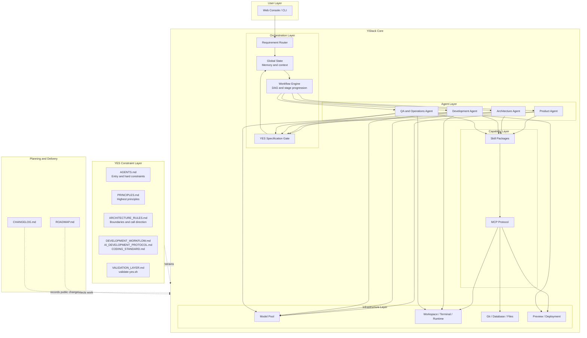
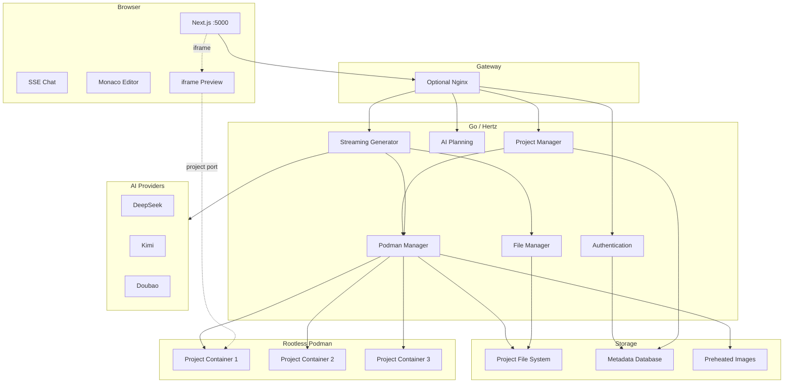
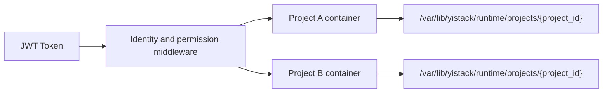
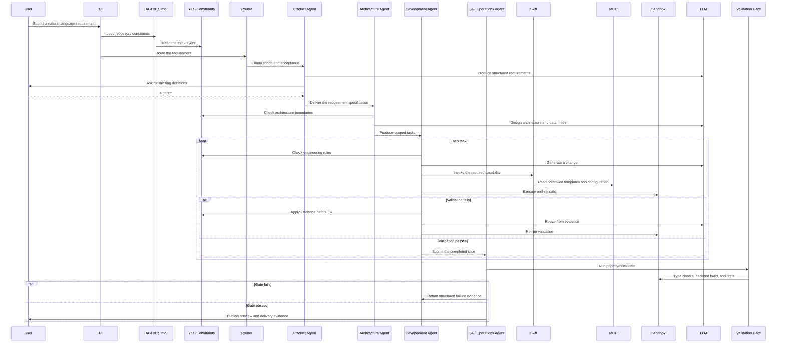
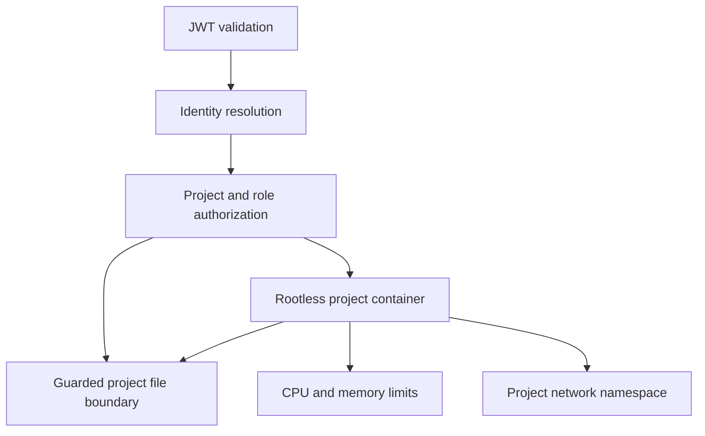
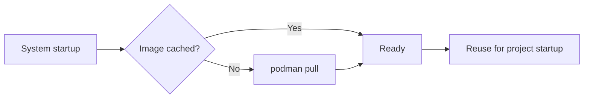

# Architecture

[简体中文](ARCHITECTURE.md) | [**English**](ARCHITECTURE.en.md)

> This is an English translation. If the two versions differ, the Chinese
> version is authoritative.
>
> **Core design:** source code lives on the file system and every project runs
> in an isolated container.
>
> This document defines architecture principles and recommended
> implementation. Current priorities and frozen work are defined in
> `docs/roadmap/ROADMAP.en.md`; public changes are recorded in
> `docs/CHANGELOG.en.md`. When an example differs from a real interface,
> `API.md` and the implementation are authoritative and this document must be
> corrected.

## 1. System Architecture

### 1.1 Target Architecture

The following model is the target for new capabilities, refactoring, task
decomposition, and module convergence. New work must not extend obsolete
assembly patterns.



### 1.1.1 Historical Implementation Baseline

The historical baseline remains useful for understanding existing topology,
but it is not the target for new architecture.



### 1.2 User Isolation

YiStack applies two independent isolation layers:

1. **JWT isolation:** every protected API call carries a valid token and
   middleware resolves the authenticated identity.
2. **Container isolation:** every project runs in a separate rootless Podman
   container with an isolated project directory.



Authorization must be checked before runtime, file, Git, preview, or project
metadata operations. A container identifier alone never grants access.

### 1.3 Backend Layers and Module Boundaries

The backend uses composition, protocol, orchestration, business, persistence,
cross-cutting, and reusable infrastructure layers:

- `cmd/server/`: composition root, process startup, global middleware, and
  route registration.
- `internal/handler/`: HTTP binding, validation, SSE/JSON responses, and error
  mapping.
- `internal/orchestration/`: primary workflow stages, access checks, and
  context assembly.
- `internal/service/`: business decisions and domain coordination.
- `internal/repository/`: database persistence only.
- `internal/middleware/`: authentication, rate limiting, request logging,
  error recovery, CORS, and security headers.
- `pkg/`: reusable container, file-system, LLM, authentication, and database
  capabilities without product-specific rules.

The default direction for planning and generation is:

```text
handler -> orchestration -> service -> repository / pkg
```

#### Composition Root

- `cmd/server/main.go` starts services, installs middleware, and registers
  routes.
- `cmd/server/bootstrap.go` constructs repositories, services,
  orchestrators, and handlers. Package-level dependency globals are not used.

#### Handler Layer

Handlers are split by interface domain:

- `project.go`: basic project CRUD and shared validation;
- `project_messages_handler.go`: project messages;
- `project_runtime_handler.go`: runtime start/stop, command execution, and
  generation cancellation;
- `project_files_handler.go`: file tree, reads, writes, and commit records;
- `project_plans_handler.go`: plan generation and SSE output;
- `auth_handler.go` and `auth_facade.go`: authentication protocol and facade;
- admin handler files: configuration, users, roles, permissions, and common
  authorization;
- `llm_provider.go`: provider management protocol.

Plan and generation handlers act as protocol containers. Request
normalization, command construction, SSE setup, orchestration error mapping,
and stream response helpers remain outside the core handler body.

#### Orchestration Layer

Core modules include:

- `workspace_plan_orchestrator.go`;
- `workspace_generate_orchestrator.go`;
- `workspace_project_access.go`;
- `workspace_orchestration_commands.go`;
- `workspace_orchestration_errors.go`.

The orchestration layer advances stages and coordinates services without
absorbing HTTP details or persistence rules.

#### Service Layer

Services are split by domain:

- `project_service.go`: project CRUD and lifecycle;
- `project_file_service.go`: file access;
- `project_runtime_facade.go` and `project_runtime_service.go`: public runtime
  entry points and low-level orchestration;
- `project_context_service.go`, `project_docs.go`, and `project_scaffold.go`:
  project context, supporting documents, and scaffolding;
- `project_initializer_service.go`: creation-time coordination;
- `project_message_service.go`: workspace messages;
- `plan_service.go`: plan generation and plan streaming;
- `generator_service.go`, `generator_discuss.go`, and `generator_stream.go`:
  implementation, discussion, and stream protocol;
- `generation_apply_service.go`: applying output, running commands, updating
  project documents, and finalizing Git;
- `runtime_policy.go`: consistent application type, runtime profile, and image
  decisions;
- dedicated chat, provider management, and admin-console services.

Prompt text lives in `internal/prompt/templates/`. Internal project artifacts
live in `internal/service/templates/project_docs/`. Fallback scaffolds live in
`internal/service/templates/project_scaffolds/`. Business code assembles
context and renders these resources; large text templates do not belong in
service source.

`ProjectService` and `GeneratorService` each use one options-based constructor.
Do not add parallel `WithContainer`, `WithFiles`, or similar constructors.

#### Middleware and Repository Layers

Middleware is split by cross-cutting concern:

- `auth_middleware.go`;
- `rate_limit_middleware.go`;
- `request_middleware.go`;
- `error_middleware.go`;
- `security_middleware.go`.

Repositories are split by aggregate or data domain, including users, projects,
chat messages, generated files, system configuration, commits, LLM providers,
and administrators.

The purpose is not to maximize file count. Each layer must own one axis of
change:

- handlers own protocol;
- orchestration owns stage coordination;
- services own business behavior;
- repositories own persistence;
- middleware owns cross-cutting HTTP behavior.

Files that repeatedly grow beyond roughly 300-400 lines must be reviewed for a
real ownership split. One function must not combine business decisions, I/O,
documents, Git, containers, and persistence.

## 2. User Workflow

### 2.1 Target Engineering Workflow

The target workflow governs clarification, architecture, implementation,
validation, preview, delivery, and task decomposition.



### 2.1.1 Historical Primary Workflow

The historical implementation remains useful for tracing existing routes:

```text
Requirement submission
  -> POST /api/project/create
  -> create metadata and project context
  -> POST /api/project/plans
  -> select a plan and persist plan_id / plan_data / tech_stack
  -> POST /api/project/{id}/start
  -> start the runtime selected by tech_stack.runtime.profile
  -> POST /api/chat/generate over SSE
  -> write and validate files in /workspace
  -> publish preview state
```

It is not the target model for new architecture.

### 2.2 Detailed Stages

#### Stage 1: Requirement Analysis and Solution Generation

The user submits a requirement and application type. The backend calls
`POST /api/project/plans`, asks the configured model for structured options,
and returns selectable solution cards.

#### Stage 2: Project Creation, Approval, and Runtime Startup

The system:

1. creates real project metadata;
2. creates the host project directory;
3. persists `plan_id`, `plan_data`, and `tech_stack`;
4. starts the runtime only after solution approval;
5. selects an image using `tech_stack.runtime.profile`;
6. writes source, documents, and Git state under `/workspace`.

The frontend then uses `/workspace?projectId={project_id}`.

#### Stage 3: Generation and Validation

The generation stream emits start, progress, chunk, step, guidance, done, and
error events.

Implementation mode requests strict `generation_result.v2` output through an
OpenAI-compatible JSON Schema. A provider that explicitly lacks schema support
may use prompt-enforced JSON, but the server applies the same validation.
Parse failures and command errors produce blocking
`generation_schema_invalid` or `generation_command_failed` results.

Recommended dependency commands must match the exact allowlist and execute as
structured arguments in `/workspace`. After file operations and recommended
commands, the project runs stack-aware dependency preparation, build, test,
and lint before preview and Git. Supported families include static HTML,
Next.js, Vite, React, Vue, generic Node, Go, and Python. Missing test or lint
configuration is recorded as `skipped_with_reason`.

Before generation, YiStack reads a bounded text snapshot and hashes each file.
The model declares `create`, `replace`, `patch`, or `delete` operations. The
server checks protected paths, dirty paths, file existence, base hashes,
unique patch context, and concurrent changes. A partial application is rolled
back in reverse order.

Validation failures produce file, line, column, diagnostic, and fingerprint
evidence. Bounded `generation_repair.v1` runs with the actual provider and
model, may edit only paths from the initial attempt, and re-runs complete
project validation. Repeated fingerprints, invalid repair output, and budget
exhaustion are blocking failures. Preview and Git never continue after them.

#### Stage 4: Project Deletion

Deletion is an owner-controlled lifecycle:

```text
stop project container
  -> remove container
  -> remove the project directory through the guarded file boundary
  -> release the preview port
  -> delete project metadata
```

The operation must preserve structured failure reporting and must never use an
unchecked user-provided path.

## 3. File-System Model

### 3.1 Physical Layout

```text
/var/lib/yistack/runtime/
├── projects/
│   └── {project_id}/
│       ├── .git/
│       ├── .yistack/
│       ├── src/
│       ├── package.json
│       └── yistack.config.json
├── templates/
└── container-data/
```

The physical host path is not exposed as the user's workspace path.

Backend template resources are organized as:

```text
backend/internal/
├── prompt/templates/                 LLM prompt templates
└── service/templates/
    ├── project_docs/                  internal project artifacts
    └── project_scaffolds/             profile-based fallback scaffolds
```

### 3.2 User-Visible Layout

The workspace exposes a virtual project tree such as:

```text
src/
├── app/
├── components/
└── lib/
package.json
```

Host paths and other users' projects are never shown.

### 3.3 Container Path

The project is mounted at:

```text
/workspace/
```

All generated commands, validation, preview startup, and project-level file
operations use this working directory.

## 4. Container Orchestration

### 4.1 Podman Manager

The container manager owns:

- runtime socket selection;
- project directory mounting;
- image selection;
- port allocation;
- resource limits;
- project labels;
- create, inspect, start, stop, remove, and command execution operations.

Conceptually:

```go
type ContainerManager struct {
    socketPath  string
    projectDir  string
    templateDir string
    portPool    *PortPool
}

type ContainerInfo struct {
    ID        string `json:"id"`
    Name      string `json:"name"`
    ProjectID string `json:"project_id"`
    Port      int    `json:"port"`
    Status    string `json:"status"`
    CreatedAt int64  `json:"created_at"`
}
```

Containers use names and labels derived from validated project identifiers.
The host project directory is mounted at `/workspace`. CPU, memory, port, and
idle-timeout policy come from controlled configuration rather than request
text.

Command execution uses structured arguments wherever possible. Shell
execution is confined to explicit compatibility boundaries and never accepts
an unchecked host path.

### 4.2 Port Management

The port pool serializes allocation and release:

```go
type PortPool struct {
    mu    sync.Mutex
    start int
    end   int
    used  map[int]bool
}
```

An allocation failure is explicit; port `0` is not silently presented as a
working preview.

### 4.3 Devbox Images and Dependency Services

The runtime policy is "prebuilt devbox first, default image as fallback."
Image selection uses `tech_stack.runtime.profile` and
`system_config.container.images`. A persisted project image is reused to
prevent configuration drift.

Stateful services such as MySQL, PostgreSQL, and Redis run in project-specific
dependency containers rather than inside the main development container. All
containers join `yistack_<projectID>_net` and communicate by container name.
Dependency services are not exposed to the host by default.

| Capability | Policy |
| --- | --- |
| Main development container | Select a prebuilt devbox by runtime profile |
| Language runtime | Preinstalled in a profile image; dynamic fallback only for the default image |
| Database and cache | Separate MySQL 8, PostgreSQL 16, or Redis 7 containers |
| Runtime record | `<project_dir>/.yistack/environment.json` |

Operational rules:

- `scripts/preheat.sh` pre-pulls base and dependency images.
- The installer preheats after finding a rootless Podman socket.
- Backend startup may preheat asynchronously without blocking service startup.
- Project start checks and pulls all required images before container launch.
- Project dependencies still install inside the development container.
- Third-party mirrors are replaceable through configuration and must not be
  hard-coded as the only source.
- Future admin controls may inspect cache state, preheat, edit mappings,
  manage image versions, and configure private registry credentials.

## 5. Database Design

The database stores metadata and durable workflow state. Project source remains
on the file system.

### 5.1 Project Metadata

The project record contains:

- authenticated owner identity;
- stable project ID, name, description, and original requirement;
- selected plan and technology stack;
- persisted container ID, port, image, and runtime status;
- disk usage and timestamps.

Row-level security isolates project ownership. High-risk access checks are
also enforced in the service layer because RLS alone does not protect
container, file-system, or Git side effects.

The historical `status` column remains only as a database field and must not
drive the current workflow.

### 5.2 Conversations and Durable Generation

Conversation records belong to a project and inherit project ownership.
Generation lifecycle data uses:

- `generation_jobs`;
- `generation_attempts`;
- `generation_events`.

`public.schema_migrations` records the known database baseline and future
upgrade versions. See
`docs/engineering/DATABASE_LIFECYCLE.en.md`.

## 6. API Design

### 6.1 Core APIs

| Method | Path | Authentication | Purpose |
| --- | --- | --- | --- |
| POST | `/api/project/plans` | JWT or anonymous planning session | Analyze requirements and generate plans |
| POST | `/api/project/create` | JWT | Create project metadata and host directory |
| GET | `/api/project/list` | JWT | List projects |
| GET | `/api/project/:id` | JWT | Read project details |
| DELETE | `/api/project/:id` | JWT | Delete project and runtime resources |
| POST | `/api/chat/generate` | JWT | Stream code generation |
| GET | `/api/project/:id/files` | JWT | List files |
| GET | `/api/project/:id/files/*` | JWT | Read a file |
| PUT | `/api/project/:id/files/*` | JWT | Save a file |
| POST | `/api/project/:id/exec` | JWT | Execute an allowed container command |
| GET | `/api/project/:id/status` | JWT | Read runtime status |

The actual route implementation and `docs/API.md` are authoritative when this
summary drifts.

### 6.2 SSE Events

Planning returns a structured `Plan[]` response. Generation emits:

```typescript
type GenerateEvent =
  | { event: 'start'; data: { status: string; message: string } }
  | { event: 'progress'; data: { progress: number; message: string } }
  | { event: 'chunk'; data: { content: string; provider?: string } }
  | { event: 'step'; data: { id: string; status: string; meta?: unknown } }
  | { event: 'guidance'; data: { suggestedQuestions?: string[] } }
  | { event: 'done'; data: { schemaVersion: 'generation_result.v2' } }
  | {
      event: 'error';
      data: {
        code?: string;
        blocking?: boolean;
        message: string;
        details?: string;
      };
    };
```

Error events retain stable reason codes and structured validation, file
conflict, repair, or browser acceptance evidence when relevant.

## 7. Technology Choices

| Layer | Technology | Supported baseline | Purpose |
| --- | --- | --- | --- |
| Frontend | Next.js / React / TypeScript | 16 / 19 / 5.9 | App Router workspace |
| UI | shadcn/ui, Radix UI, Tailwind CSS | current lockfile | Accessible components |
| Editor | Monaco Editor | current lockfile | Source editing |
| Backend | Go and Hertz | Go 1.21.6+ | API and orchestration |
| ORM | GORM | current lockfile | PostgreSQL access |
| Runtime | rootless Podman | 3.4+ | Project isolation |
| Database | Supabase/PostgreSQL | PostgreSQL 15+ for verification | Metadata and durable state |
| AI | OpenAI-compatible providers | configured at runtime | Planning and generation |

Key open-source components retain their own licenses, including MIT,
Apache-2.0, and the PostgreSQL License. Dependency licensing is reviewed
separately from YiStack's Apache-2.0 project license.

## 8. Security Design

### 8.1 Isolation



Security controls include:

| Control | Requirement |
| --- | --- |
| Authentication | Protected APIs require a valid JWT |
| Authorization | Project ownership or collaboration role is checked before side effects |
| RLS | Database rows are protected by user and project policy |
| Rootless runtime | Project containers never require a root daemon |
| Resource policy | CPU, memory, disk, port, and idle limits are enforced |
| Network boundary | Dependency containers are project-scoped and host exposure is explicit |
| Input validation | IDs, paths, URLs, commands, and payloads are bounded |
| Command execution | Allowlisted commands and structured arguments are preferred |
| Secrets | Provider, GitHub, deployment, and service-role credentials remain server-side |

## 9. Performance and Lifecycle

### 9.1 Image Preheating



Preheating reduces first-start latency but does not bypass image verification
or project startup failure handling.

### 9.2 Container Lifecycle

| State | Trigger | Action |
| --- | --- | --- |
| `created` | Project creation | Initialize directory and Git |
| `starting` | First preview or explicit start | Start the runtime |
| `running` | Runtime ready | Serve preview and commands |
| `stopped` | Idle timeout or explicit stop | Stop container and retain source |
| `deleted` | Owner-confirmed deletion | Remove runtime and project files |

Port range, idle timeout, and per-user limits come from runtime configuration.
State transitions must remain consistent across database constraints, backend
logic, frontend types, and UI rendering.

## 10. Durable Generation Job Architecture

Supabase Job and Event records are the source of truth for generation. The
lifecycle is not tied to the initiating HTTP context:

```text
POST /api/chat/generate
  -> idempotency and single-active-job guard
  -> create generation_jobs(queued)
  -> background runner acquires lease
  -> append generation_events with monotonic sequence
  -> generation_attempts records initial and repair evidence
  -> atomic terminal transition updates Job and Attempt
     and inserts exactly one terminal event

SSE subscriber
  -> replay after cursor or Last-Event-ID
  -> follow the active Job
  -> disconnect closes only the subscriber
  -> reconnect continues from the last sequence
```

`append_generation_event` holds a database row lock while deduplicating event
keys, assigning sequence numbers, inserting the event, and updating the Job
sequence. `create_generation_attempt` atomically inserts an attempt and moves
`current_attempt`.

`transition_generation_job_terminal` performs terminal compare-and-set, the
unique terminal event, final Job state, and running-attempt close-out in one
transaction. This prevents a successful Job whose `done` event cannot be
replayed and prevents sequence gaps.

Workers use a 30-second lease and a 10-second heartbeat. Expired jobs in
`queued`, `running`, `repairing`, `validating`, or `previewing` become
`interrupted` when they cannot be resumed safely. A backend restart never
pretends that stale work is still running. The in-process cancellation map
only accelerates cancellation on the current worker.

The frontend has two recovery paths:

1. When the original POST stream disconnects, reconnect by
   `X-Generation-Job-ID` and the last event sequence.
2. When that response header is unavailable, find the exact Job through the
   request `idempotency_key`.

Page reload uses Job status and event replay. Fixed system narration is not
written into the ordinary chat stream.

## 11. Deployment Architecture

### 11.1 Single-Node Deployment

```mermaid
graph TB
    subgraph Server[Single Server]
        Proxy[Nginx or Caddy]
        Frontend[Next.js :5000]
        Backend[Go :8080<br/>User yistack]
        Socket[Rootless Podman socket]
        Database[PostgreSQL]
        App[/opt/yistack]
        Config[/etc/yistack]
        Data[/var/lib/yistack]
        Logs[/var/log/yistack]
    end
    subgraph Projects[Project Containers]
        Node[Node.js]
        Python[Python]
        Go[Go]
    end

    Proxy --> Frontend
    Proxy --> Backend
    Backend --> Socket
    Backend --> Database
    Backend --> Config
    Backend --> Data
    Backend --> Logs
    Socket --> Node
    Socket --> Python
    Socket --> Go
    Data -->|bind mount /workspace| Node
    Data -->|bind mount /workspace| Python
    Data -->|bind mount /workspace| Go
```

The backend process, rootless Podman socket, and project container lifecycle
belong to the fixed `yistack` service account. Updating `/opt/yistack` must not
modify project data under `/var/lib/yistack`.

### 11.2 Configuration

The process environment contains only bootstrap and secret-bearing settings:

```bash
APP_HOST=127.0.0.1
APP_PORT=8080
FRONTEND_HOST=127.0.0.1
FRONTEND_PORT=5000

DB_TYPE=supabase
SUPABASE_URL=
SUPABASE_ANON_KEY=
SUPABASE_SERVICE_ROLE_KEY=
SUPABASE_DB_PASSWORD=

JWT_SECRET=
JWT_EXPIRY=86400

CONTAINER_ENABLED=true
CONTAINER_RUNTIME=podman
CONTAINER_SOCKET_PATH=/run/user/<yistack_uid>/podman/podman.sock
CONTAINER_PROJECT_DIR=/var/lib/yistack/runtime/projects
CONTAINER_TEMPLATE_DIR=/var/lib/yistack/runtime/templates
CONTAINER_DATA_DIR=/var/lib/yistack/runtime/container-data

YISTACK_INSTALL_DIR=/opt/yistack
YISTACK_CONFIG_DIR=/etc/yistack
YISTACK_DATA_DIR=/var/lib/yistack
YISTACK_LOG_DIR=/var/log/yistack
YISTACK_CACHE_DIR=/var/cache/yistack
```

Runtime provider configuration is managed through the admin console and
database. API keys are not committed to `.env.example`.

Development installation uses repository-local paths:

```bash
INSTALL_MODE=development bash scripts/install.sh
```

## 12. Browser Acceptance and Benchmark

The generation quality order is:

```text
apply
  -> recommended commands
  -> project validation and bounded repair
  -> preview
  -> browser acceptance
  -> Git commit
  -> durable terminal event
```

`scripts/browser-acceptance-worker.mjs` listens only on loopback and delegates
to `scripts/lib/browser-acceptance.mjs`. The Playwright kernel records:

- console errors;
- uncaught page errors;
- failed critical responses and requests;
- DOM and root visibility;
- requested and final URLs;
- deterministic smoke actions;
- a full-page screenshot.

Evidence is stored under
`runtime/generation-evidence/<job-id>/...`, outside generated project roots.
The durable Generation Job event retains evidence metadata.

`evals/canonical-prompts.v1.json` is the versioned 24-sample suite.
`scripts/run-generation-benchmark.mjs` fixes provider, model, prompt version,
and suite hash, then reports:

- schema validity;
- first-pass build;
- repair outcome;
- final build;
- preview;
- browser acceptance;
- latency;
- terminal-event uniqueness;
- failure classification.

Missing provider token usage remains explicit `null`; it is never estimated.
