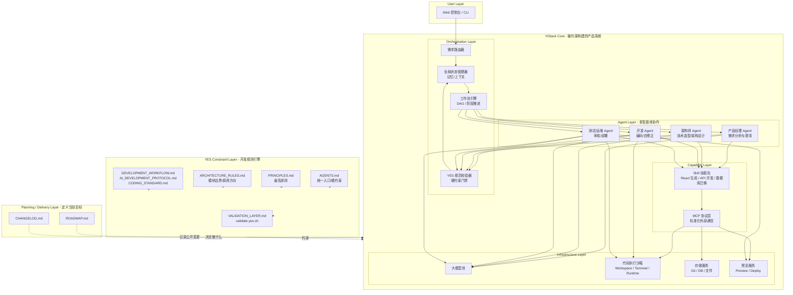
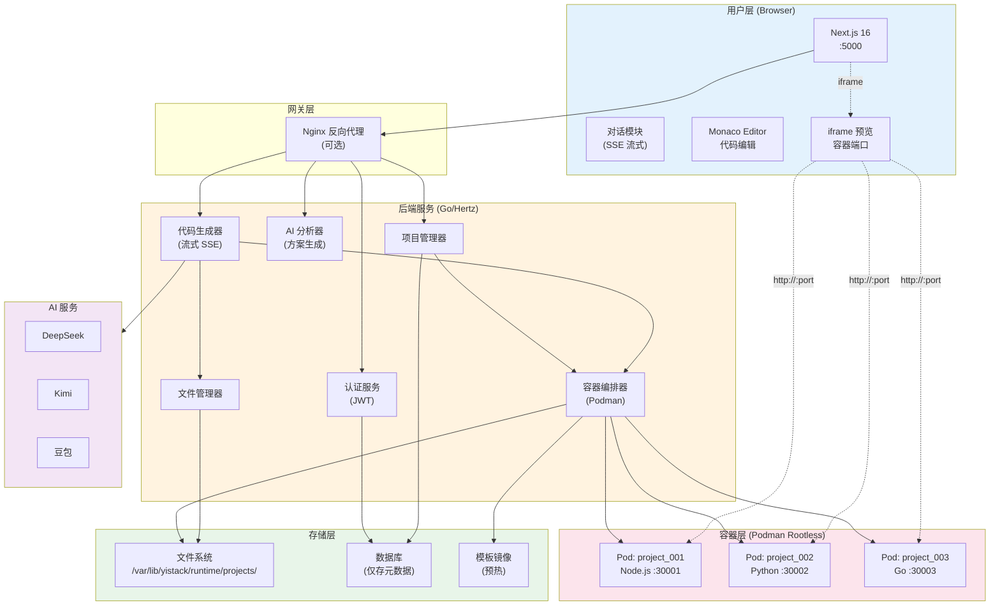
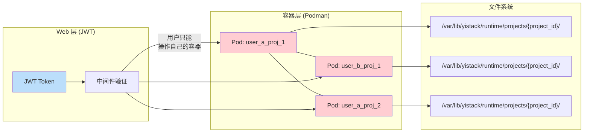
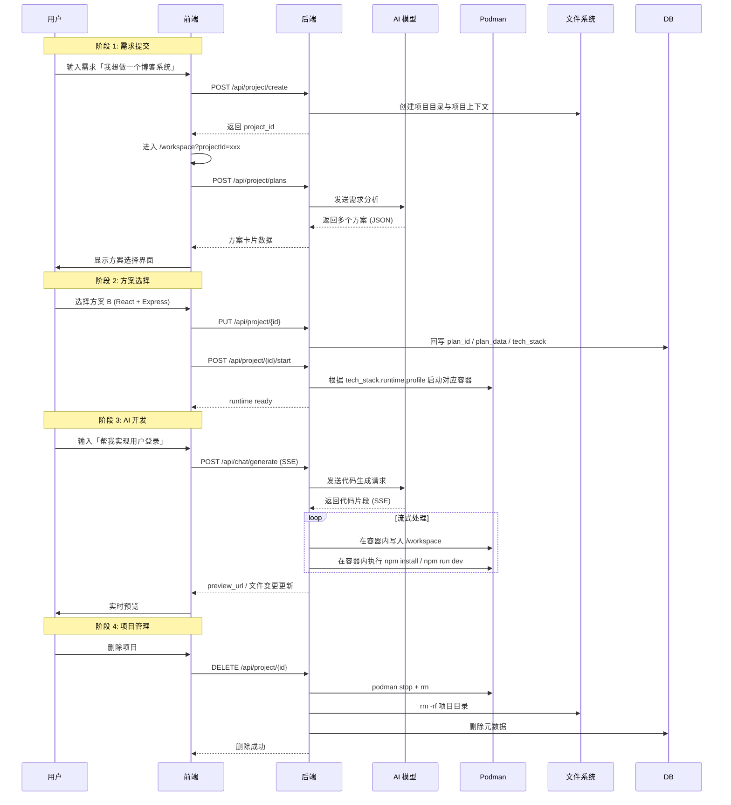
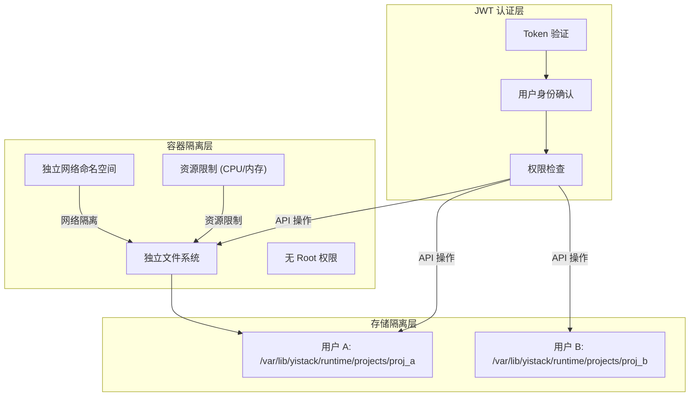
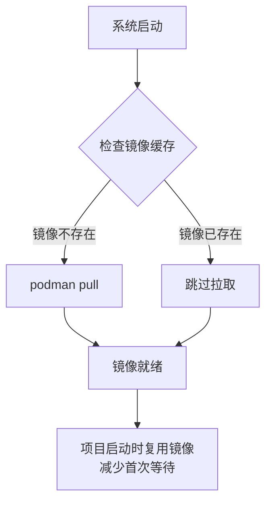
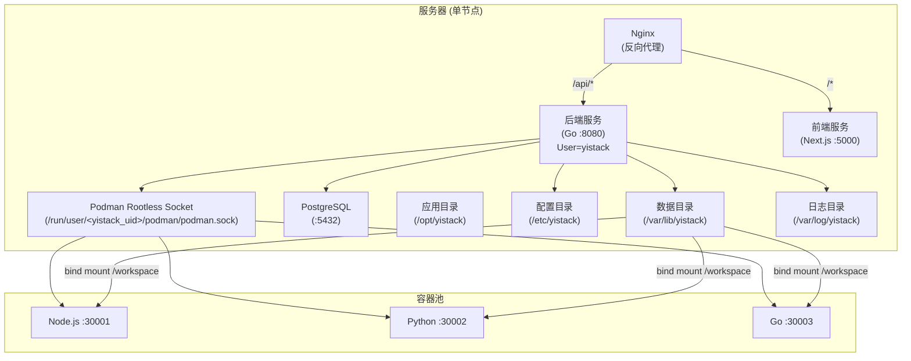

# 架构设计文档

> **核心设计理念**：代码存储在文件系统 + 每个项目独立容器运行
>
> 说明：
>
> - 本文档描述的是架构原则与推荐实现方式
> - 当前阶段目标、优先级与冻结项请看 `docs/roadmap/ROADMAP.md`
> - 面向用户的变更请看 `CHANGELOG.md`，完成情况以可执行门禁为准
> - 如果本文档中的流程示例与真实接口不一致，应以 `API.md` 和实际代码为准，并及时回写本文件

---

## 1. 系统架构

### 1.1 目标态总体架构

以下架构图是 YiStack 后续实现的唯一目标模型。

后续新增能力、重构、任务拆分与模块收敛，默认都应以这张图为目标，而不是继续沿用旧的实现拼装方式。



### 1.1.1 历史实现基线（仅供存量理解）

以下架构图对应 YES 体系建立前后的历史实现基线。

它只用于帮助理解当前仍存在的存量代码组织和运行拓扑，不再作为后续新增能力和架构收敛的目标模型。



### 1.2 用户隔离策略



**双重隔离机制**：
1. **JWT 隔离**：API 请求必须携带有效 Token，中间件验证用户身份
2. **容器隔离**：每个项目运行在独立 Podman 容器中，文件系统完全隔离

### 1.3 后端分层与模块边界

当前后端代码组织遵循“组合根 / 协议层 / 编排层 / 业务层 / 持久化层 / 通用能力层”分层：

- `cmd/server/`：组合根与启动入口，只负责依赖装配、服务启动、全局中间件与路由注册
- `handler/`：只负责 HTTP 协议转换、参数校验、SSE/JSON 响应组装，不直接承载复杂业务编排
- `orchestration/`：承接主链路最小编排入口，负责阶段推进、访问校验、上下文组织，不直接承担 HTTP 协议细节
- `service/`：只负责业务编排与领域协作，不直接承担 HTTP 协议细节
- `repository/`：只负责数据库访问与持久化，不承担业务规则
- `middleware/`：只负责横切关注点，例如认证、限流、请求日志、错误处理、安全头
- `pkg/`：只放容器、文件系统、LLM、认证 SDK 等通用能力，不承载具体业务规则

当前后端的真实结构已经从“少数大文件”演进到“按职责拆分的多模块结构”：

#### 组合根

- `cmd/server/main.go`：服务启动、全局中间件挂载、路由注册
- `cmd/server/bootstrap.go`：集中初始化 `repository / service / handler`，不再使用散落的包级全局依赖变量

#### Handler 层

`internal/handler/` 已按接口域继续拆分，避免把多个变化轴塞进单个 handler 文件：

- `project.go`：项目基础 CRUD 与共享校验逻辑
- `project_messages_handler.go`：项目消息接口
- `project_runtime_handler.go`：runtime 启停、命令执行、停止生成
- `project_files_handler.go`：文件树、文件读写、提交记录
- `project_plans_handler.go`：方案生成与 SSE 输出
- `auth_handler.go` + `auth_facade.go`：认证协议层与认证门面
- `admin_handler.go`：管理员身份校验与通用前置判断
- `admin_config_handler.go` / `admin_users_handler.go` / `admin_roles_handler.go`：后台配置、用户、角色与权限接口
- `llm_provider.go`：LLM provider 管理协议入口

当前 `plans / generate` 主链路的 handler 已进一步收敛为“容器层”形态：请求绑定、兼容字段归一化、command 组装、SSE writer 准备、编排错误映射与流式回包样板都已通过辅助文件收口，handler 本体不再直接承载访问校验和大段流式协议细节。

#### Orchestration 层

`internal/orchestration/` 已作为后端最小编排层落地，当前核心模块包括：

- `workspace_plan_orchestrator.go`：方案链路最小编排入口
- `workspace_generate_orchestrator.go`：代码生成链路最小编排入口
- `workspace_project_access.go`：项目归属与访问校验
- `workspace_orchestration_commands.go`：主链路 command 定义
- `workspace_orchestration_errors.go`：主链路业务错误定义

当前约束是：`handler -> orchestration -> service` 成为 `plans / generate` 主链路默认调用方向，handler 不再直接把完整业务推进压回 `PlanService / GeneratorService`。

#### Service 层

`internal/service/` 已按领域拆分，不再把项目 CRUD、方案生成、代码生成、容器编排、聊天、后台管理与系统配置塞进单个大文件。当前核心模块包括：

- `project_service.go`：项目核心 CRUD 与生命周期
- `project_file_service.go`：项目文件读写与文件树入口
- `project_runtime_facade.go` / `project_runtime_service.go`：runtime 对外入口与底层编排
- `project_context_service.go` / `project_docs.go` / `project_scaffold.go`：项目上下文、项目文档与脚手架初始化
- `project_initializer_service.go`：项目创建期初始化协作
- `project_message_service.go`：项目工作台消息读写
- `plan_service.go`：方案生成与方案流式输出
- `generator_service.go` / `generator_discuss.go`：实现模式与探讨模式
- `generation_apply_service.go`：生成结果落地、命令执行、文档与 Git 收尾
- `generator_stream.go`：统一流式事件协议与 UTF-8 安全切分
- `runtime_policy.go`：`app_type` / `tech_stack.runtime.profile` / image 的统一决策
- `chat_service.go`：普通 AI 对话
- `provider_manager_service.go`：LLM provider 热加载
- `llm_provider_admin_service.go`：LLM provider 后台管理编排
- `admin_console_service.go`：后台控制台领域服务定义与公共能力
- `admin_console_config_service.go` / `admin_console_user_service.go` / `admin_console_rbac_service.go` / `admin_console_support_service.go`：后台配置、用户、RBAC、审计与 payload 组装

其中，文本资源已进一步从 Go 代码中抽离：

- `internal/prompt/templates/`：`plan` / `generate` / `discuss` 的提示词模板资源
- `internal/service/templates/project_docs/`：YiStack 内部项目工件 `.yistack/AGENTS.md`、`.yistack/docs/REQUIREMENTS.md`、`.yistack/docs/DESIGN.md`、`.yistack/docs/RUNBOOK.md` 模板
- `internal/service/templates/project_scaffolds/`：按 `tech_stack.runtime.profile` 组织的兜底脚手架模板

当前约束是：业务代码负责组装上下文与渲染模板，提示词正文、Markdown 模板和兜底脚手架内容不再继续大段硬编码在 service 文件中。

此外，`ProjectService` 与 `GeneratorService` 的构造方式已收敛为单一 options 注入模式：

- `ProjectServiceOptions` + `NewProjectService(...)`
- `GeneratorServiceOptions` + `NewGeneratorService(...)`

不再继续维护 `WithContainer` / `WithFiles` 之类的多套并列构造器。

#### Middleware 层

`internal/middleware/` 已从单文件拆为按横切关注点分组：

- `auth_middleware.go`：JWT 认证、角色校验、管理员权限点校验
- `rate_limit_middleware.go`：请求限流
- `request_middleware.go`：请求日志与 Request ID
- `error_middleware.go`：统一错误响应、panic recovery
- `security_middleware.go`：CORS 与安全响应头

#### Repository 层

`internal/repository/` 已从单个 `repository.go` 拆为按聚合根和数据域分组：

- `user_repository.go`
- `project_repository.go`
- `chat_repository.go`
- `generated_file_repository.go`
- `system_config_repository.go`
- `commit_repository.go`
- `llm_provider_repository.go`
- `admin_repository.go`

这样做的目标不是“文件越多越好”，而是让每一层都只承载单一变化轴：

- `handler` 只处理协议，不直接拼装复杂 repo 流程
- `service` 只处理应用编排，不直接承担 HTTP 与路由细节
- `repository` 只处理持久化，不直接承担权限、审计或业务决策
- `middleware` 只处理横切逻辑，不混入业务模块职责

后续实现应继续遵守以下约束：

- 一个 `service` 文件只承载一个清晰领域职责
- 一个 `handler` 文件只承载一个接口域或一个清晰的子领域
- 一个 `repository` 文件只承载一个聚合根或一个清晰的数据域
- 当单个文件持续增长到约 `300-400` 行时，必须评估可拆分边界
- 避免一个函数同时承担“业务决策 + IO + 文档写入 + Git + 容器 + 持久化”多种变化轴
- 避免在 `handler` 中直接串联多个 repo 完成业务流程
- 导出函数、导出类型和关键跨文件协作函数必须带中文注释

---

## 2. 用户流程

### 2.1 目标态工程交互流程

以下时序图是 YiStack 后续实现的唯一目标流程模型。

后续需求澄清、架构设计、编码、验证、预览、交付与任务拆分，默认都应围绕这条流程推进；旧的用户主流程图仅作为历史实现参考，不再作为后续能力设计的统一基线。

```mermaid
sequenceDiagram
    participant User
    participant UI
    participant Entry as AGENTS.md<br>统一入口
    participant YES as YES 五层约束
    participant Router
    participant PM as 产品经理 Agent
    participant ArchAgent as 架构师 Agent
    participant DevAgent as 开发 Agent
    participant QA as 测试/运维 Agent
    participant Skill as Skill 技能包
    participant MCP as MCP 协议层
    participant Sandbox
    participant LLM
    participant Valid as VALIDATION_LAYER<br>验证门禁

    User->>UI: 输入自然语言需求
    UI->>Entry: 进入开发前，先读 AGENTS.md
    Entry->>YES: 按顺序理解 YES.md 与各层文档
    YES-->>UI: 加载完成，进入开发流程

    UI->>Router: 转发需求
    Router->>PM: 分配至产品经理 Agent
    PM->>YES: 检查 Execution Layer：先澄清
    PM->>LLM: 调用模型澄清需求
    LLM-->>PM: 返回结构化需求
    PM->>User: 通过 UI 追问细节
    User-->>PM: 反馈确认
    PM->>YES: 确认需求文档符合 YES 模板

    PM->>ArchAgent: 交付需求规格
    ArchAgent->>YES: 检查 Architecture Layer：模块边界
    ArchAgent->>LLM: 设计架构与数据模型
    LLM-->>ArchAgent: 返回设计方案
    ArchAgent->>YES: 确认符合既定分层与调用方向
    ArchAgent->>DevAgent: 拆分任务列表

    loop 每个任务
        DevAgent->>YES: 检查 Principle：AI is Engineer
        DevAgent->>LLM: 生成代码片段
        DevAgent->>Skill: 调用对应 Skill
        Skill->>MCP: 读取模板与配置
        MCP-->>Skill: 返回模板与配置
        Skill-->>DevAgent: 返回生成代码

        DevAgent->>Sandbox: 在沙箱中运行与验证
        Sandbox-->>DevAgent: 返回执行结果或报错

        alt 有错误
            DevAgent->>YES: 检查 Principle：Evidence before Fix
            DevAgent->>LLM: 分析错误并修正
            DevAgent->>Sandbox: 重新运行
        else 通过
            DevAgent->>QA: 提交完成模块
        end
    end

    QA->>YES: 检查 Validation Layer：最小验证门禁
    QA->>Valid: 执行 pnpm yes:validate
    Valid->>Sandbox: 运行前端类型检查
    Valid->>Sandbox: 运行后端构建
    Valid->>Sandbox: 运行关键 service 测试
    Sandbox-->>Valid: 返回验证结果

    alt 验证失败
        Valid-->>QA: 返回失败报告
        QA->>DevAgent: 打回修正
        DevAgent->>LLM: 根据报告修正
    else 验证通过
        Valid-->>QA: 验证通过
        QA->>User: 生成预览链接
        QA->>MCP: 通过 MCP 部署代码
        MCP-->>QA: 部署完成
    end
```



### 2.1.1 历史用户主流程（仅供存量理解）

以下流程图对应的是历史阶段用于打通产品主链路的实现方式。

它仍有助于理解当前接口与运行链路，但不再作为后续架构演进、交互设计和任务实现的统一目标流程。



### 2.2 流程详细说明

#### 阶段 1: 需求分析与方案生成

```
用户操作：
1. 访问首页
2. 输入需求：「我想做一个博客系统，支持文章发布、评论、用户登录」
3. 选择应用类型：Web 应用
4. 点击「生成方案」

后端处理：
POST /api/project/plans
  ↓
调用 AI 分析需求
  ↓
返回多个方案 (JSON)

前端展示：
┌─────────────┐  ┌─────────────┐  ┌─────────────┐
│  方案 A     │  │  方案 B     │  │  方案 C     │
│  Next.js   │  │  React+    │  │  Vue3+    │
│  (推荐)     │  │  Express   │  │  FastAPI  │
│  [选择]     │  │  [选择]     │  │  [选择]    │
└─────────────┘  └─────────────┘  └─────────────┘
```

#### 阶段 2: 项目创建、方案确认与 runtime 启动

```
用户提交需求后先创建项目 → 选择方案 → 点击「开始开发」

后端执行：
┌────────────────────────────────────────────────┐
│ 1. 创建真实项目元数据                         │
│ 2. mkdir -p 容器挂载项目目录                  │
│ 3. 保存 plan_id / plan_data / tech_stack      │
│ 4. 方案确认后启动 runtime 容器                │
│ 5. 按 tech_stack.runtime.profile 选择镜像     │
│ 6. 代码、文档、Git 均在容器内写入 /workspace │
└────────────────────────────────────────────────┘

前端更新为: /workspace?projectId={project_id}
```

#### 阶段 3: AI 代码生成与容器运行

```
用户输入: 「帮我实现用户注册登录」

SSE 事件流:
event: start → {"status": "understanding", "message": "正在理解您的需求..."}
event: progress → {"progress": 20, "message": "正在生成代码..."}
event: chunk → {"content": "..."}
event: progress → {"progress": 60, "message": "正在写入文件..."}
event: progress → {"progress": 80, "message": "正在容器中执行安装命令..."}
event: done → {"schemaVersion": "generation_result.v2", "operations": [...], "files": [...], "commands": [...], "projectValidation": {"status": "passed", "stack": "node-nextjs", "checks": [...]}, "content": "..."}

前端实时更新:
┌──────────────────────────────────────┐
│ AI 助手:                              │
│ 正在分析需求... ✓                     │
│ 创建文件 /src/models/User.js ✓        │
│ 运行 npm install... ✓                 │
│ ✅ 服务已启动: localhost:30001        │
└──────────────────────────────────────┘
```

实现模式先通过 OpenAI-compatible `json_schema` 请求版本化 `generation_result.v2`；Provider 明确不支持时回退为 Prompt 严格 JSON，但仍由服务端执行相同 Schema 校验。协议解析失败或推荐命令 error、timeout、nil result、非零退出码会分别以 `generation_schema_invalid` / `generation_command_failed` 阻断。

模型推荐命令先命中精确依赖准备 allowlist，再以结构化 argv 和固定 `/workspace` 执行。生成文件和推荐命令成功后，项目容器会按 stack-aware plan 执行依赖准备、build、test、lint，再进入 Preview 和 Git。当前覆盖 static HTML、Next/Vite/React/Vue/通用 Node、Go 和 Python；未配置 test/lint 时必须记录 `skipped_with_reason`。检查失败返回 `project_validation_failed` 并携带检查证据，不能继续 Preview、Git commit 或成功 `done`。

生成前会读取受限 workspace 文本快照并为每个文件提供 SHA-256；模型通过 `create/replace/patch/delete` operation 声明修改。服务端在写入前统一执行 protected path、dirty path、存在性、base hash 与唯一 patch context preflight，应用前再次校验并发变化，部分应用失败时逆序回滚；成功后由服务端计算 `result_hash`。Validation 失败会提取文件/行/列 diagnostics 和 failure fingerprint，并使用实际生成 Provider/Model 执行默认最多 2 轮 `generation_repair.v1`；每轮仅能修改初始 attempt 路径并重新运行完整 Project Validation。重复 fingerprint、无效修复结果或预算耗尽会结构化失败，Preview 与 Git 不会继续。YiStack 仓库的 `yes:validate` 保持平台开发门禁，不再由 GenerateOrchestrator 在项目收口后执行。

#### 阶段 4: 项目删除与清理

```
用户点击删除 → 确认删除

后端执行:
┌────────────────────────────────────────────────┐
│ 1. podman stop proj_{id}                       │
│ 2. podman rm proj_{id}                        │
│ 3. rm -rf /var/lib/yistack/runtime/projects/{project_id} │
│ 4. 释放端口 30001                             │
│ 5. DELETE FROM projects WHERE id = '{id}'    │
└────────────────────────────────────────────────┘
```

---

## 3. 文件系统结构

### 3.1 物理结构 (用户不可见)

```
/data/
├── projects/                      # 项目根目录
│   ├── {project_id}/             # 项目目录 (用户不可见物理路径)
│   │   ├── .git/                 # Git 仓库
│   │   ├── src/                  # 用户代码
│   │   │   ├── app/
│   │   │   ├── components/
│   │   │   ├── lib/
│   │   │   └── page.tsx
│   │   ├── package.json
│   │   ├── package-lock.json
│   │   ├── tsconfig.json
│   │   ├── tailwind.config.ts
│   │   ├── next.config.ts
│   │   └── yistack.config.json   # YiStack 项目配置
│   └── ...
│
└── templates/                    # 模板目录 (系统级 / 运行时镜像等)
    ├── node-nextjs/
    │   ├── Dockerfile
    │   └── template/
    ├── node-react/
    └── python-fastapi/

backend/internal/
├── prompt/
│   ├── plan.go
│   ├── generate.go
│   ├── discuss.go
│   ├── templates.go
│   └── templates/               # LLM 提示词模板资源
│       ├── plan_system.tmpl
│       ├── plan_output_protocol.tmpl
│       ├── plan_user.tmpl
│       ├── generate_system.tmpl
│       └── discuss_system.tmpl
└── service/
    └── templates/
        ├── project_docs/        # YiStack 内部项目 Markdown 工件模板
        └── project_scaffolds/   # 按 tech_stack.runtime.profile 组织的兜底脚手架模板
```

### 3.2 虚拟结构 (用户可见)

用户在工作台看到的文件树**不包含**物理路径：

```
📁 src/
├── 📁 app/
│   ├── 📄 page.tsx
│   └── 📄 layout.tsx
├── 📁 components/
│   └── 📄 Button.tsx
└── 📄 package.json
```

### 3.3 容器内路径

容器内应用看到的路径：

```
/workspace/              # 容器内工作目录
├── src/
│   └── ...
├── package.json
└── ...
```

---

## 4. 容器编排设计

### 4.1 Podman 管理模块

```go
// backend/pkg/container/manager.go

type ContainerManager struct {
    socketPath  string        // /run/user/<yistack_uid>/podman/podman.sock
    projectDir  string        // /var/lib/yistack/runtime/projects
    templateDir string        // /var/lib/yistack/runtime/templates
    portPool    *PortPool     // 端口分配器
}

type ContainerInfo struct {
    ID        string `json:"id"`
    Name      string `json:"name"`
    ProjectID string `json:"project_id"`
    Port      int    `json:"port"`       // 主机端口
    Status    string `json:"status"`     // running/stopped
    CreatedAt int64  `json:"created_at"`
}

// 创建项目容器
func (m *ContainerManager) Create(ctx context.Context, req *CreateRequest) (*ContainerInfo, error) {
    // 1. 分配端口
    port := m.portPool.Allocate()

    // 2. 创建容器
    containerID, err := m.podman.Run(podman.RunOptions{
        Name:    fmt.Sprintf("yistack_%s", req.ProjectID),
        Image:   req.Template, // 如 "docker.io/library/node:20-bookworm-slim"
        Ports:   []string{fmt.Sprintf("%d:3000", port)},
        Volumes: []string{fmt.Sprintf("%s/%s:/workspace", m.projectDir, req.ProjectID)},
        Labels:  map[string]string{
            "yistack.project": req.ProjectID,
            "yistack.user":    req.UserID,
        },
        Memory: "1g",
        Cpus:   "1",
    })

    return &ContainerInfo{
        ID:        containerID,
        Name:      fmt.Sprintf("yistack_%s", req.ProjectID),
        ProjectID: req.ProjectID,
        Port:      port,
        Status:    "running",
    }, nil
}

// 删除项目容器
func (m *ContainerManager) Delete(ctx context.Context, projectID string) error {
    // 1. 获取容器信息
    info, _ := m.Get(projectID)

    // 2. 停止容器
    m.podman.Stop(info.Name)

    // 3. 删除容器
    m.podman.Rm(info.Name)

    // 4. 释放端口
    m.portPool.Release(info.Port)

    return nil
}

// 在容器中执行命令
func (m *ContainerManager) Exec(ctx context.Context, projectID, command string) (string, error) {
    return m.podman.Exec(info.Name, "/bin/sh", "-c", command)
}
```

### 4.2 端口管理

```go
type PortPool struct {
    mu     sync.Mutex
    start  int
    end    int
    used   map[int]bool
}

func NewPortPool(start, end int) *PortPool {
    return &PortPool{
        start: start,
        end:   end,
        used:  make(map[int]bool),
    }
}

func (p *PortPool) Allocate() int {
    p.mu.Lock()
    defer p.mu.Unlock()

    for port := p.start; port <= p.end; port++ {
        if !p.used[port] {
            p.used[port] = true
            return port
        }
    }
    return 0 // 无可用端口
}

func (p *PortPool) Release(port int) {
    p.mu.Lock()
    defer p.mu.Unlock()
    delete(p.used, port)
}
```

### 4.3 动态开发环境与依赖服务

YiStack 当前采用“预构建 devbox 优先，default 默认镜像兜底”的运行时策略。项目确认方案后，后端先根据 `tech_stack.runtime.profile` 从 `system_config.container.images` 选择主开发容器镜像；如果项目记录里已有 `container_image`，则优先复用该镜像，避免默认配置变更导致旧项目漂移。命中 profile 专用 devbox 时，运行时准备阶段只做工具校验，不再在容器启动后执行 `apt-get` 安装；只有回退到默认基础镜像时，才保留旧的动态安装链路。运行时规格仍写入项目目录 `.yistack/environment.json`，用于后续复用容器时比对 `specHash`。

MySQL、PostgreSQL、Redis 等状态服务不安装进主开发容器，而是按 `tech_stack.services` / `tech_stack.database` 创建项目专属依赖容器。主容器和依赖容器加入 `yistack_<projectID>_net` 项目网络，通过容器名通信；依赖服务默认不暴露到宿主机，减少端口占用和安全面。

| 能力 | 当前策略 |
|------|----------|
| 主开发容器 | 按 `container.images` 中的 runtime profile 选择预构建 devbox |
| 语言环境 | 专用 devbox 镜像内预装；仅默认基础镜像兜底时走容器内按需安装 |
| 数据库/缓存 | MySQL 8、PostgreSQL 16、Redis 7 独立依赖容器 |
| 状态记录 | `<project_dir>/.yistack/environment.json` |

当前阶段策略：

- 保留 `scripts/preheat.sh` 脚本预热能力，用于安装、部署或开发环境手动预拉基础镜像和常用依赖服务镜像。
- 安装脚本在检测到 rootless Podman socket 后调用 `scripts/preheat.sh`，生产模式使用 `yistack` 用户执行。
- 安装脚本会为 rootless Podman 写入 `~/.config/containers/registries.conf`，给 `docker.io` 配置国内 mirror。生产模式写入 `yistack` 用户的配置，开发模式写入当前用户的配置。
- 后端启动后异步执行镜像预热，不阻塞服务启动。
- `POST /api/project/:id/start` 会按当前项目方案检查基础镜像和依赖服务镜像；如果镜像缺失，则在启动前补拉。
- 项目级依赖仍在容器内安装，例如 `pnpm install`、`pip install -r requirements.txt`、`go mod tidy`。

安装时可通过环境变量调整镜像源：

```bash
PODMAN_DOCKER_IO_MIRRORS="https://docker.1ms.run https://docker.xuanyuan.me https://docker.1panel.live https://dockerproxy.net" bash scripts/install.sh
PODMAN_CONFIGURE_MIRRORS=false bash scripts/install.sh
```

第三方镜像站可能存在 tag 不完整、限流或临时不可用。遇到 `manifest unknown`、`too many requests`、`connection reset by peer` 时，应先替换 mirror 或使用企业内网 registry；默认预热失败不会跳过容器主流程，项目启动时仍会按需补拉对应镜像。

后续镜像管理规划：

- 短期在管理后台展示基础镜像、依赖服务镜像、本机镜像缓存状态，并支持手动预热/重新拉取。
- 中期支持管理员编辑 `container.images` 和依赖服务镜像映射，用于替换为企业内网镜像仓库，并在保存后拉取验证。
- 后期再支持镜像版本升级、删除未使用镜像、项目锁定镜像版本、回滚和私有 registry 凭证管理。

如果生产环境需要使用企业内网镜像仓库，应通过 `container.images` 配置替换镜像地址，而不是在代码中硬编码第三方镜像源。当前建议把镜像记录维持为简单的 `type + image (+ priority/enabled)` 结构，管理员在后台维护多个候选镜像，后端启动时先查本地，不存在再按配置拉取。

---

## 5. 数据库设计

### 5.1 元数据表 (仅存元数据)

```sql
-- 项目表
CREATE TABLE app.projects (
    id UUID PRIMARY KEY DEFAULT uuid_generate_v4(),
    user_id UUID NOT NULL REFERENCES auth.users(id) ON DELETE CASCADE,
    project_id VARCHAR(50) UNIQUE NOT NULL,  -- proj_abc123

    -- 项目信息
    name VARCHAR(255) NOT NULL,
    description TEXT,
    requirement TEXT,              -- 用户原始需求
    app_type VARCHAR(50) DEFAULT 'web',

    -- 方案配置
    plan_selected JSONB,           -- {"id": "plan_a", "tech_stack": {...}}

    -- 遗留字段：当前仅保留数据库字段，不参与业务流程，后续可物理删除
    status VARCHAR(20) DEFAULT '',

    -- 容器信息
    container_id VARCHAR(100),
    container_port INTEGER,
    container_image VARCHAR(100),  -- 使用的镜像
    container_status VARCHAR(20),   -- running/stopped/starting

    -- 资源统计
    disk_usage BIGINT DEFAULT 0,

    -- 时间戳
    created_at TIMESTAMP WITH TIME ZONE DEFAULT NOW(),
    updated_at TIMESTAMP WITH TIME ZONE DEFAULT NOW()
);

-- RLS 策略 (用户隔离)
ALTER TABLE app.projects ENABLE ROW LEVEL SECURITY;

CREATE POLICY "Users manage own projects" ON app.projects
    FOR ALL USING (auth.uid() = user_id);

-- 索引
CREATE INDEX idx_projects_user_id ON app.projects(user_id);
```

### 5.2 对话历史表

```sql
CREATE TABLE app.conversations (
    id UUID PRIMARY KEY DEFAULT uuid_generate_v4(),
    project_id UUID NOT NULL REFERENCES app.projects(id) ON DELETE CASCADE,
    messages JSONB DEFAULT '[]',  -- [{"role": "user", "content": "...", "timestamp": "..."}]
    created_at TIMESTAMP WITH TIME ZONE DEFAULT NOW()
);

ALTER TABLE app.conversations ENABLE ROW LEVEL SECURITY;
CREATE POLICY "Users access own conversations" ON app.conversations
    FOR ALL USING (
        EXISTS (
            SELECT 1 FROM app.projects
            WHERE id = conversations.project_id AND user_id = auth.uid()
        )
    );
```

---

## 6. API 设计

### 6.1 核心 API

| 方法 | 路径 | 认证 | 描述 |
|------|------|------|------|
| POST | /api/project/plans | JWT/匿名规划会话 | 需求分析，生成方案 |
| POST | /api/project/create | JWT | 创建项目元数据与宿主机项目目录 |
| GET | /api/project/list | JWT | 获取项目列表 |
| GET | /api/project/:id | JWT | 获取项目详情 |
| DELETE | /api/project/:id | JWT | 删除项目 (含容器清理) |
| POST | /api/chat/generate | JWT | 代码生成 (SSE 流式) |
| GET | /api/project/:id/files | JWT | 获取文件列表 |
| GET | /api/project/:id/files/* | JWT | 读取文件内容 |
| PUT | /api/project/:id/files/* | JWT | 保存文件内容 |
| POST | /api/project/:id/exec | JWT | 在容器中执行命令 |
| GET | /api/project/:id/status | JWT | 获取容器状态 |

### 6.2 SSE 事件类型

```typescript
// /api/project/plans 返回的响应
type PlansResponse = {
  success: true;
  data: Plan[];
};

// /api/chat/generate 返回的事件
type GenerateEvent =
  | { event: "start"; data: { status: string; message: string } }
  | { event: "progress"; data: { progress: number; message: string } }
  | { event: "chunk"; data: { content: string; provider?: string } }
  | { event: "step"; data: { id: string; status: string; meta?: unknown } }
  | { event: "done"; data: { schemaVersion: "generation_result.v2"; content: string; operations: unknown[]; files: unknown[]; commands: string[]; repair?: unknown; projectValidation: { status: "passed"; stack: string; checks: unknown[]; diagnostics?: unknown[] } } }
  | { event: "guidance"; data: { suggestedQuestions?: string[]; suggestedActions?: unknown[] } }
  | { event: "error"; data: { code?: "generation_schema_invalid" | "generation_file_conflict" | "generation_command_failed" | "project_validation_failed" | "repair_result_invalid" | "repair_budget_exhausted" | "repair_repeated_failure" | string; blocking?: boolean; message: string; details?: string; project_validation?: unknown; file_conflict?: unknown; repair?: unknown } };
```

---

## 7. 技术栈

### 7.1 技术选型

| 层级 | 技术 | 版本 | 说明 |
|------|------|------|------|
| 前端框架 | Next.js | 16 | App Router, React 19, TypeScript 5 |
| UI 组件 | shadcn/ui | - | 基于 Radix UI, Tailwind CSS 4 |
| 编辑器 | Monaco Editor | 0.52 | VS Code 同款编辑器 |
| 后端框架 | Hertz | 0.10 | 字节跳动开源高性能框架 |
| 后端语言 | Go | 1.22 | 高性能、并发支持 |
| 容器引擎 | Podman | 4.x | Rootless 容器，无需守护进程 |
| 数据库 | PostgreSQL | 15+ | 关系型数据存储 (仅存元数据) |
| ORM | GORM | 1.25 | Go ORM 库 |
| AI 集成 | SDK | - | DeepSeek, Kimi, 豆包 |

### 7.2 开源组件清单

| 组件 | 用途 | 许可证 | 可替代方案 |
|------|------|--------|------------|
| Next.js | 前端框架 | MIT | Vite/Remix |
| Hertz | HTTP 框架 | Apache 2.0 | Gin/Fiber |
| shadcn/ui | UI 组件 | MIT | 自研组件库 |
| Monaco Editor | 代码编辑器 | MIT | CodeMirror |
| GORM | ORM | Apache 2.0 | raw SQL |
| Podman | 容器引擎 | Apache 2.0 | Docker |
| PostgreSQL | 数据库 | PostgreSQL | MySQL |

---

## 8. 安全设计

### 8.1 隔离策略



### 8.2 安全措施

| 措施 | 说明 |
|------|------|
| JWT 认证 | 所有 API 必须携带有效 Token |
| RLS 策略 | 数据库行级安全策略 |
| 容器 Rootless | Podman rootless 模式 |
| 资源限制 | CPU、内存、磁盘配额 |
| 网络隔离 | 容器间网络隔离 |
| 输入验证 | 请求参数严格校验 |
| 命令执行 | 容器内命令白名单限制 |

---

## 9. 性能优化

### 9.1 开发镜像预热



### 9.2 容器生命周期

| 状态 | 触发条件 | 动作 |
|------|----------|------|
| created | 创建项目 | 初始化目录 + Git |
| starting | 首次预览 | 启动容器 |
| running | 容器运行中 | 提供预览服务 |
| stopped | 闲置超时 | 停止容器 (保留代码) |
| deleted | 用户删除 | 清理容器 + 文件 |

### 9.3 端口池配置

```yaml
# 端口范围配置
container:
  port_pool:
    start: 30000
    end: 40000
  idle_timeout: 1800  # 30分钟无活动停止容器
  max_per_user: 10   # 每用户最多 10 个容器
```

---

## 9. Generation Job 持久执行架构

生成生命周期以 Supabase Job/Event 为真源，不再绑定发起请求的 HTTP context：

```text
POST /api/chat/generate
  -> idempotency / single-active guard
  -> create generation_jobs(queued)
  -> background runner acquires lease
  -> append generation_events with monotonic sequence
  -> generation_attempts records initial/repair evidence
  -> atomic terminal transition updates Job/Attempt and inserts terminal event

SSE subscriber
  -> replay events after cursor / Last-Event-ID
  -> follow active Job
  -> disconnect closes subscriber only
  -> reconnect continues from last sequence
```

`append_generation_event` 在数据库行锁内完成 event key 去重、sequence 分配、event insert 和 Job sequence 更新。`create_generation_attempt` 原子写入 attempt 并推进 Job `current_attempt`。`transition_generation_job_terminal` 在同一事务内完成 terminal CAS、唯一 `terminal` event、Job 终态和 running attempt 收口，避免出现“Job 成功但 done 不可回放”或 sequence 空洞。

Worker 使用 30 秒 lease 和 10 秒 heartbeat。无法安全续跑的过期 queued/running/repairing/validating/previewing Job 转为 `interrupted`；不会把后端重启后的旧任务伪装为仍在运行。进程内 cancel map 只用于当前 worker 的快速取消，不是状态真源。

前端有两条恢复路径：原始 POST SSE 中断时按 `X-Generation-Job-ID` 和最后 sequence 接入 GET replay；响应头不可用时以请求 `idempotency_key` 对照 Job 摘要精确恢复。页面刷新后同样从 status + events 恢复，不向普通聊天流写固定系统提示。

---

## 10. 部署架构

### 10.1 单机部署



生产部署使用固定服务用户 `yistack`。后端进程、Podman rootless socket 和项目容器生命周期操作都归属该用户，禁止自动连接 root 用户的 Podman socket。应用安装目录、配置、数据和日志按 Linux 目录职责拆分，升级 `/opt/yistack` 时不得影响 `/var/lib/yistack` 中的项目数据。

### 10.2 环境变量

```bash
# 后端环境变量
SERVER_PORT=8080
DB_TYPE=postgres
DB_HOST=localhost
DB_PORT=5432
DB_USER=postgres
DB_PASSWORD=xxx
DB_NAME=yistack

# JWT 配置
JWT_SECRET=xxx
JWT_EXPIRY=86400

# 容器配置
CONTAINER_ENABLED=true
CONTAINER_RUNTIME=podman
CONTAINER_SOCKET_PATH=/run/user/<yistack_uid>/podman/podman.sock
CONTAINER_PROJECT_DIR=/var/lib/yistack/runtime/projects
CONTAINER_TEMPLATE_DIR=/var/lib/yistack/runtime/templates
CONTAINER_DATA_DIR=/var/lib/yistack/runtime/container-data
CONTAINER_PORT_RANGE_START=30000
CONTAINER_PORT_RANGE_END=40000

# 生产目录
YISTACK_INSTALL_DIR=/opt/yistack
YISTACK_CONFIG_DIR=/etc/yistack
YISTACK_DATA_DIR=/var/lib/yistack
YISTACK_LOG_DIR=/var/log/yistack
YISTACK_CACHE_DIR=/var/cache/yistack

# LLM 配置
LLM_DEFAULT_PROVIDER=deepseek
DEEPSEEK_API_KEY=xxx
```

开发模式执行 `INSTALL_MODE=development bash scripts/install.sh` 时不创建生产目录，默认使用项目内路径：

```bash
YISTACK_INSTALL_DIR=<repo>
YISTACK_CONFIG_DIR=<repo>/.yistack
YISTACK_DATA_DIR=<repo>/runtime
YISTACK_LOG_DIR=<repo>/logs
YISTACK_CACHE_DIR=<repo>/.cache/yistack
```

## R5 Browser Acceptance And Benchmark

The generation quality order is now `apply -> commands -> project validation/repair -> preview -> browser acceptance -> Git commit -> terminal event`. `scripts/browser-acceptance-worker.mjs` listens only on loopback and delegates to the Playwright kernel in `scripts/lib/browser-acceptance.mjs`. The kernel captures console errors, uncaught page errors, failed critical responses/requests, DOM visibility, final URL, smoke actions and a full-page screenshot. Evidence is stored under `runtime/generation-evidence/<job-id>/...`, outside generated project roots, while the durable Generation Job event retains its evidence metadata.

`evals/canonical-prompts.v1.json` is the versioned 24-sample suite. `scripts/run-generation-benchmark.mjs` fixes Provider, Model, prompt version and suite hash, then reports schema, first-pass build, repair, final build, preview, browser acceptance, latency, terminal uniqueness and failure classification. Missing provider token usage remains explicit `null`; it is not estimated.
