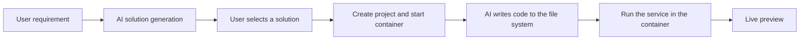

# YiStack Developer Guide

[简体中文](DEVELOPER_GUIDE.md) |
[**English**](DEVELOPER_GUIDE.en.md)

> This is an English translation for new contributors. If the two versions
> differ, the Chinese version is authoritative.

## Contents

- [Introduction](#introduction)
- [Requirements](#requirements)
- [Quick Start](#quick-start)
- [Repository Layout](#repository-layout)
- [Development Conventions](#development-conventions)
- [API Reference](#api-reference)
- [Troubleshooting](#troubleshooting)

## Introduction

**YiStack** is a natural-language application generation platform. A user
describes an idea, selects a proposed solution, and receives a runnable
application.

### Core Design

> **Source code lives on the file system, and every project runs in an
> isolated container.**



### Technology Stack

| Layer | Technology |
| --- | --- |
| Frontend | Next.js 16, React 19, TypeScript, Tailwind CSS, shadcn/ui |
| Backend | Go and Hertz |
| Containers | Rootless Podman |
| Database | PostgreSQL for metadata |
| AI | OpenAI-compatible providers including DeepSeek, Kimi, and Doubao |

## Requirements

| Component | Version | Purpose |
| --- | --- | --- |
| Node.js | 22.x | Frontend development |
| pnpm | 11.5.2 | Package management |
| Go | 1.26.6+ | Backend development |
| Podman | 3.4+ | Container runtime |
| Git | Any supported version | Version control |

Verify the toolchain:

```bash
node -v
pnpm -v
go version
podman --version
git --version
```

## Quick Start

### 1. Clone

```bash
git clone https://github.com/NHPT/YiStack.git
cd YiStack
```

### 2. Install Dependencies

```bash
pnpm install --frozen-lockfile
(cd backend && go mod download)
```

### 3. Configure the Environment

Create the root environment file:

```bash
cp .env.example .env
```

Configure Supabase, JWT, bind addresses, and any external integration you
intend to enable. LLM providers are not loaded from
`LLM_DEFAULT_PROVIDER` or individual API-key environment variables. After
startup, save, preflight, and reload providers from the admin console. All
seeded providers are disabled by default.

The frontend normally needs no separate environment file. It reaches the
backend through the same-origin `/api` path.

### Production Directories

Do not store project data inside the application installation directory in
production. Initialize the standard layout with:

```bash
sudo bash scripts/install.sh
```

The installer creates the `yistack` service account and these paths:

```text
/opt/yistack                 application installation
/etc/yistack/yistack.env     production configuration
/var/lib/yistack             project data and container mounts
/var/log/yistack             logs
/var/cache/yistack           rebuildable caches
```

Run the production backend as `yistack` and connect it to
`/run/user/<yistack_uid>/podman/podman.sock`. Never connect it to the root
Podman socket.

### 4. Initialize the Database

For Supabase, apply `backend/init.sql` in the SQL Editor. To validate the full
baseline against an isolated local PostgreSQL container, run:

```bash
bash scripts/verify-supabase-baseline.sh
```

### 5. Prebuilt Devbox Runtime Policy

YiStack prefers prebuilt devbox images. After solution approval, the backend
selects an image from `system_config.container.images` using
`tech_stack.runtime.profile`. If the project already stores a
`container_image`, that image wins so later default changes do not move an
existing project to a different runtime.

A recommended image configuration is:

```json
[
  { "type": "node-nextjs", "image": "ghcr.1ms.run/chaitin/monkeycode-runner/devbox:bookworm" },
  { "type": "node-react", "image": "ghcr.1ms.run/chaitin/monkeycode-runner/devbox:bookworm" },
  { "type": "default", "image": "docker.io/library/node:20-bookworm-slim" }
]
```

The backend uses an existing local image first and pulls only when necessary.
A profile-specific devbox performs lightweight tool verification instead of
running `apt-get` after container startup. Dynamic installation remains only
for the default base-image fallback.

Runtime state is recorded in `.yistack/environment.json` under the project.
For a prebuilt image, this file means that the runtime specification was
verified; it does not mean an installer just ran inside the container.

Preheat configured images and build a devbox with:

```bash
bash scripts/preheat.sh
bash scripts/build-devbox.sh \
  --image ghcr.1ms.run/chaitin/monkeycode-runner/devbox:bookworm
podman push ghcr.1ms.run/chaitin/monkeycode-runner/devbox:bookworm
```

The installer configures domestic `docker.io` mirrors for the current user or
the production `yistack` account. Development mode creates only repository
local `.yistack`, `runtime`, `logs`, and `.cache/yistack` directories:

```bash
INSTALL_MODE=development bash scripts/install.sh
```

Leave `CONTAINER_SOCKET_PATH` empty unless the deployment uses a non-standard
socket. The backend detects the Podman or Docker socket from
`CONTAINER_RUNTIME`.

Frontend, backend, and startup scripts read only the repository-root `.env`.
`BACKEND_URL` is the server-side address used by Next.js to reach Go.
`NEXT_PUBLIC_API_URL` should normally remain empty so the browser uses
same-origin `/api` through Nginx or Caddy.

When the Projects page reports
`project list proxy failed (source: next_api_proxy)`, first verify the Go
backend rather than the project-list business logic:

```bash
curl -i http://127.0.0.1:8080/api/health
```

`scripts/dev.sh` and `scripts/start.sh` wait for `/api/health` before reporting
that the system is running. If the backend exits or does not become healthy
within 30 seconds, the scripts print the health endpoint and backend log, then
fail instead of leaving a frontend that continuously returns proxy errors.

Override or disable container registry mirrors with:

```bash
PODMAN_DOCKER_IO_MIRRORS="https://docker.1ms.run https://docker.xuanyuan.me https://docker.1panel.live https://dockerproxy.net" \
  bash scripts/install.sh
PODMAN_CONFIGURE_MIRRORS=false bash scripts/install.sh
```

Errors such as `manifest unknown`, `too many requests`, or
`connection reset by peer` usually mean that a mirror lacks the tag, is rate
limited, or cannot reach Docker Hub. Replace the mirror, use an internal
registry, or run `podman pull <image>` to test the exact source.

Image status, manual preheating, mapping changes, and upgrade governance are
planned for the admin console.

### 6. Start Development Servers

Recommended:

```bash
bash scripts/dev.sh
```

Manual startup:

```bash
# Terminal 1
cd backend
go run ./cmd/server/

# Terminal 2
pnpm dev

# Terminal 3, when needed
podman system service --time=0 \
  unix:///run/user/1000/podman/podman.sock
```

### 7. Open YiStack

- Frontend: <http://localhost:5000>
- Backend API: <http://localhost:8080>

## Repository Layout

```text
YiStack/
├── .github/               CI, ownership, issue, and pull request configuration
├── AGENTS.md              engineering entry point
├── scripts/               build, startup, validation, and audit scripts
├── src/                   Next.js frontend
│   ├── app/               App Router pages and Route Handlers
│   ├── components/        React components
│   ├── contexts/          shared React contexts
│   ├── hooks/             reusable hooks
│   ├── lib/               utilities and API clients
│   └── types/             TypeScript types
├── docs/                  public product and engineering documentation
├── evals/                 canonical prompts and executable fixtures
└── backend/               Go backend
    ├── cmd/server/        composition root and startup
    ├── config/            process configuration
    ├── internal/
    │   ├── handler/       HTTP protocol layer
    │   ├── orchestration/ primary workflow orchestration
    │   ├── service/       business logic
    │   ├── repository/    persistence
    │   ├── model/         data models
    │   └── middleware/    cross-cutting HTTP behavior
    └── pkg/               reusable container, LLM, auth, file, and DB packages
```

## Development Conventions

### Backend Ownership

Keep backend responsibilities separated:

- `cmd/server/main.go`: service startup, global middleware, and route
  registration.
- `cmd/server/bootstrap.go`: repository, service, orchestration, and handler
  construction.
- `handler`: request binding, validation, SSE/JSON response construction, and
  protocol error mapping.
- `orchestration`: stage progression, project access checks, and context
  assembly for primary workflows.
- `service`: business decisions and domain collaboration.
- `repository`: database access only.
- `middleware`: authentication, rate limiting, request IDs, error recovery,
  CORS, and security headers.
- `pkg`: reusable infrastructure without product-specific business rules.

The main plan and generation call direction is:

```text
handler -> orchestration -> service -> repository or infrastructure package
```

Recommended service ownership includes:

- `project_service.go` for the core project lifecycle;
- `project_file_service.go` for project file access;
- `project_runtime_facade.go` and `project_runtime_service.go` for runtime;
- `project_context_service.go`, `project_docs.go`, and `project_scaffold.go`
  for context, project documents, and scaffolding;
- `project_initializer_service.go` for creation-time coordination;
- `project_message_service.go` for workspace messages;
- `plan_service.go` for solution generation;
- `generator_service.go`, `generator_discuss.go`, and `generator_stream.go`
  for implementation, discussion, and streaming;
- `generation_apply_service.go` for applying output, running commands,
  updating documents, and finalizing Git;
- `runtime_policy.go` and `llm_fallback.go` for runtime and model decisions;
- dedicated admin console files for configuration, users, RBAC, audit, and
  response assembly.

Use a single options-based constructor for each domain service:

- `ProjectServiceOptions` with `NewProjectService(...)`;
- `GeneratorServiceOptions` with `NewGeneratorService(...)`.

Do not add parallel constructors for every dependency combination.

### Template Resources

Templates have three distinct owners:

1. `backend/internal/prompt/templates/` contains LLM prompt templates.
2. `backend/internal/service/templates/project_docs/` contains internal
   `.yistack` project-document templates.
3. `backend/internal/service/templates/project_scaffolds/` contains fallback
   scaffolds selected by `tech_stack.runtime.profile`.

The boundary is:

- change `.tmpl` files for template text;
- change the corresponding Go renderer when template variables change;
- change a service or handler only when invocation timing or business flow
  changes.

#### Prompt Templates

| Template | API or mode | Entry point |
| --- | --- | --- |
| `prompt/templates/plan_system.tmpl` | `POST /api/project/plans` | `PlanService.generatePlansInternal(...)` |
| `prompt/templates/plan_output_protocol.tmpl` | plan stream protocol | `PlanService.generatePlansInternal(...)` |
| `prompt/templates/plan_user.tmpl` | plan user context | `PlanService.generatePlansInternal(...)` |
| `prompt/templates/generate_system.tmpl` | implementation mode | `GeneratorService.Generate(...)` |
| `prompt/templates/discuss_system.tmpl` | discussion mode | `GeneratorService.generateDiscussion(...)` |

Important generation constraints:

- Implementation mode uses `generation_result.v2` and strict server-side
  schema validation. Admin prompts cannot override truthful failures such as
  `generation_schema_invalid` and `generation_command_failed`.
- Recommended commands must pass the dependency allowlist and run as
  structured arguments in `/workspace`.
- Stack-aware dependency preparation, build, test, and lint run after
  generated commands and before preview or Git.
- Missing test or lint configuration is recorded as `skipped_with_reason`.
- File changes use `create`, `replace`, `patch`, or `delete` operations with
  base hashes, dirty-path checks, concurrent-change checks, and rollback.
- Automatic repair defaults to at most two rounds, uses the actual provider
  and model, and may modify only paths from the initial attempt.
- Generation Job state is durable. An in-process map, HTTP context, or one SSE
  connection is never the source of truth.
- Event sequences are assigned atomically by
  `GenerationJobRepo.AppendEvent()`. Terminal state uses
  `CompleteJob()` or `CancelActiveJob()` and writes one replayable terminal
  event in the same transaction.

#### Project Document Templates

| Template | Generated file |
| --- | --- |
| `project_docs/AGENTS.md.tmpl` | `.yistack/AGENTS.md` |
| `project_docs/REQUIREMENTS.md.tmpl` | `.yistack/docs/REQUIREMENTS.md` |
| `project_docs/DESIGN.md.tmpl` | `.yistack/docs/DESIGN.md` |
| `project_docs/RUNBOOK.md.tmpl` | `.yistack/docs/RUNBOOK.md` |

These are YiStack-owned supporting documents under `.yistack/`. A document
explicitly requested by the user must be generated at the requested path
instead of being forced into this namespace.

Built-in content may be overridden through an Admin Config key derived from
the template path. For example,
`templates/project_docs/REQUIREMENTS.md.tmpl` maps to
`template.project_docs.requirements_md`. Missing, empty, or invalid overrides
fall back to the embedded template.

#### Fallback Scaffold Templates

| Template directory | Runtime profile | Typical output |
| --- | --- | --- |
| `project_scaffolds/node-nextjs/` | `node-nextjs` | package, TypeScript, app files, `.gitignore` |
| `project_scaffolds/python-fastapi/` | `python-fastapi` | requirements, `main.py`, Dockerfile |
| `project_scaffolds/go-gin/` | `go-gin` | `go.mod`, `main.go`, Dockerfile |
| `project_scaffolds/default/README.md.tmpl` | other profiles | `README.md` |

Scaffolds provide only a minimal runnable starting point. Implementation-mode
generation remains responsible for real application code.

### Code Style

Frontend:

- use strict TypeScript;
- use function components and hooks;
- use the existing shadcn/ui component library;
- keep protocol assembly out of page components.

Backend:

- follow standard Go conventions;
- keep internal code in `internal` and reusable infrastructure in `pkg`;
- use explicit errors or domain error types;
- keep handlers limited to protocol conversion and response assembly;
- keep services limited to business orchestration;
- keep repositories limited to persistence;
- keep `cmd/server` limited to composition, startup, and routing;
- reassess a service file when it grows beyond roughly 300-400 lines;
- do not combine business decisions, I/O, document writes, Git, containers,
  and persistence in one function;
- keep runtime policy in dedicated helpers;
- document exported types, exported functions, and important cross-file
  coordination.

### API Response Design

```typescript
interface ApiResponse<T = unknown> {
  success: boolean;
  data?: T;
  error?: string;
  source?: string;
  details?: string;
  reason_code?: string;
}
```

Auth, Project, LLM, and Admin APIs normally use the
`success/data/error` envelope. Next.js proxy failures must retain
`source=next_api_proxy` and diagnostic details. Backend connectivity failures
must retain `reason_code=backend_unreachable`.

### Container Development

```bash
podman run -d \
  --name yistack_test \
  -p 30001:3000 \
  -v ./data:/workspace \
  docker.io/library/node:20-bookworm-slim

podman exec yistack_test bash -lc 'node -v && npm install'
podman exec yistack_test npm run dev
podman logs -f yistack_test
podman stop yistack_test
podman rm yistack_test
```

## API Reference

### Authentication

| Method | Path | Purpose |
| --- | --- | --- |
| POST | `/api/auth/register` | Register |
| POST | `/api/auth/login` | Log in |
| POST | `/api/auth/refresh` | Refresh token |

### Projects

| Method | Path | Purpose |
| --- | --- | --- |
| POST | `/api/project/plans` | Analyze requirements and generate solutions |
| POST | `/api/project/create` | Create project metadata and start the runtime |
| GET | `/api/project/list` | List projects |
| GET | `/api/project/:id` | Read a project |
| DELETE | `/api/project/:id` | Delete a project and clean its container |

### Generation and Files

| Method | Path | Purpose |
| --- | --- | --- |
| POST | `/api/chat/generate` | Stream code generation over SSE |
| GET | `/api/project/:id/files` | List files |
| GET | `/api/project/:id/files/*` | Read a file |
| PUT | `/api/project/:id/files/*` | Save a file |

See [API.md](./API.md) for the complete API reference.

## Troubleshooting

### Podman Does Not Start

```bash
podman info
podman system service --time=0 \
  unix:///run/user/1000/podman/podman.sock
ss -tuln | grep 30000
```

### A Container Cannot Reach the Network

```bash
podman run --rm alpine ping -c 3 google.com
podman run --network=host ...
```

### The Frontend Cannot Reach the Backend

```bash
curl http://localhost:8080/api/health
```

Check `BACKEND_URL`, the Go process, and CORS only when a cross-origin
deployment is intentional.

### Database Connection Fails

```bash
pg_isready -h localhost -p 5432
psql -U postgres -d yistack -c "SELECT 1;"
```

### LLM Calls Fail

Check the provider configuration, run provider preflight in the admin console,
and reload the provider registry. Do not print API keys in logs or terminal
output.

### A Port Is Already in Use

```bash
ss -tuln | grep :PORT
podman stop $(podman ps -q --filter "publish=PORT")
```

## Next Steps

1. Read [ARCHITECTURE.en.md](./ARCHITECTURE.en.md).
2. Read [API.md](./API.md).
3. Compare the implementation with the architecture boundaries.
4. Run the application and test the primary workflow.
5. Select work from the [public roadmap](./roadmap/ROADMAP.en.md).

## Contact

- Issues: <https://github.com/NHPT/YiStack/issues>
- Documentation fixes are accepted through pull requests.

## Browser Acceptance and Canonical Evaluation

Install controlled Chromium once with:

```bash
pnpm browser:install
```

`pnpm dev` and the production startup script launch the loopback worker
automatically. It can also be started directly with:

```bash
pnpm browser:worker
```

Run a fixed-model benchmark by setting `YISTACK_EVAL_TOKEN` and explicit
provider/model values:

```bash
pnpm eval:canonical -- --provider <provider> --model <model>
```

Reports and screenshots are written under `runtime/evals` and
`runtime/generation-evidence`, never into a generated application root.
`pnpm eval:smoke` selects one canonical sample. Reports are comparable only
when provider, model, prompt version, and suite hash match.
