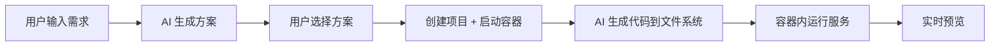

# YiStack 一栈 - 开发者指南

[**简体中文**](DEVELOPER_GUIDE.md) |
[English](DEVELOPER_GUIDE.en.md)

> 本文件是开发者指南的中文主版本。中英文内容不一致时，以本文件为准。
>
> 本文档面向新的开发伙伴，帮助你快速上手项目开发。

---

## 目录

- [项目简介](#项目简介)
- [环境要求](#环境要求)
- [快速开始](#快速开始)
- [项目结构](#项目结构)
- [开发规范](#开发规范)
- [API 文档](#api-文档)
- [常见问题](#常见问题)

---

## 项目简介

**YiStack 一栈** 是一个基于自然语言的应用生成平台。只需用一句话描述你的想法，即可生成完整的可运行应用。

### 核心设计

> **代码存储在文件系统 + 每个项目独立容器运行**



### 技术栈

| 层级 | 技术 |
|------|------|
| 前端 | Next.js 16, React 19, TypeScript, Tailwind CSS, shadcn/ui |
| 后端 | Go + Hertz |
| 容器 | Podman (Rootless) |
| 数据库 | PostgreSQL (仅存元数据) |
| AI | DeepSeek, Kimi, 豆包 |

---

## 环境要求

### 必需

| 组件 | 版本 | 说明 |
|------|------|------|
| Node.js | 22.x | 前端开发 |
| pnpm | 11.5.2 | 包管理器 |
| Go | 1.21.6+ | 后端开发 |
| Podman | 3.4+ | 容器引擎 |
| Git | - | 版本控制 |

### 验证安装

```bash
# 验证各组件版本
node -v    # v22.x.x
pnpm -v    # 11.5.2
go version # go1.21.x
podman --version  # 3.4.x or newer
git --version
```

---

## 快速开始

### 1. 克隆项目

```bash
git clone <repository-url>
cd yistack
```

### 2. 安装依赖

```bash
# 安装前端依赖
pnpm install --frozen-lockfile

# Go 依赖 (后端)
cd backend && go mod download && cd ..
```

### 3. 配置环境变量

#### 根目录 `.env`

```bash
cp .env.example .env
```

按 `.env.example` 配置 Supabase、JWT、监听地址和需要启用的外部集成。LLM Provider 不再通过 `LLM_DEFAULT_PROVIDER` 或单独的 API Key 环境变量加载；请启动系统后在管理端保存、预检并 reload Provider。所有 Provider seed 默认禁用。

#### 前端 - 无需配置

前端 API 地址已内置默认值，通过 `/api` 相对路径访问后端。

#### 生产部署目录

生产环境不要把项目数据放在应用安装目录内。推荐通过 `scripts/install.sh` 初始化：

```bash
sudo bash scripts/install.sh
```

安装脚本会创建 `yistack` 服务用户，并初始化以下目录：

```text
/opt/yistack                 应用安装目录
/etc/yistack/yistack.env     生产环境配置
/var/lib/yistack             项目数据和容器挂载目录
/var/log/yistack             日志目录
/var/cache/yistack           可重建缓存目录
```

生产后端应以 `yistack` 用户运行，并连接 `/run/user/<yistack_uid>/podman/podman.sock`，不要连接 root socket。

### 4. 初始化数据库

```bash
# 使用 Supabase（推荐）：在 SQL Editor 中执行 backend/init.sql

# 使用隔离的本地 PostgreSQL 容器验证完整 baseline
bash scripts/verify-supabase-baseline.sh
```

### 5. 预构建 devbox 运行时策略

YiStack 现在优先使用预构建 devbox 镜像。方案确认后，后端先根据 `tech_stack.runtime.profile` 从 `system_config.container.images` 选择镜像；如果项目已经落库了 `container_image`，则优先复用项目自己的镜像，避免管理员后来改默认配置时把旧项目漂移到新镜像。

镜像配置推荐保持简单，直接存可拉取的完整镜像地址，例如：

```json
[
  { "type": "node-nextjs", "image": "ghcr.1ms.run/chaitin/monkeycode-runner/devbox:bookworm" },
  { "type": "node-react", "image": "ghcr.1ms.run/chaitin/monkeycode-runner/devbox:bookworm" },
  { "type": "default", "image": "docker.io/library/node:20-bookworm-slim" }
]
```

后端会先检查本地镜像是否已存在；本地有就直接使用，本地没有再自动拉取。命中 profile 专用镜像时，运行时准备阶段只做轻量校验，不再执行 `apt-get` 安装；只有回退到 `default` 默认基础镜像时，才保留旧的动态安装链路。

安装状态仍会写入项目目录 `.yistack/environment.json`；不过预构建镜像场景下，该文件表示“校验通过的运行时规格”，不再等价于“容器内刚执行过安装脚本”。开发环境可以手动预热当前配置中的镜像和依赖服务镜像：

```bash
bash scripts/preheat.sh
bash scripts/build-devbox.sh --image ghcr.1ms.run/chaitin/monkeycode-runner/devbox:bookworm
podman push ghcr.1ms.run/chaitin/monkeycode-runner/devbox:bookworm
```

安装脚本会为当前用户或生产 `yistack` 用户配置 rootless Podman 的 `docker.io` 国内 mirror。开发模式执行 `INSTALL_MODE=development bash scripts/install.sh` 时只创建项目内的 `.yistack`、`runtime`、`logs`、`.cache/yistack` 目录，不创建 `/opt/yistack`、`/etc/yistack`、`/var/lib/yistack` 等生产目录。

`CONTAINER_SOCKET_PATH` 现在建议留空，后端会按 `CONTAINER_RUNTIME` 自动探测 Podman 或 Docker socket；只有部署环境 socket 不在常规路径时才需要显式覆盖。

前后端与启动脚本现在统一只读取项目根目录 `.env`。`BACKEND_URL` 用于 Next.js 服务端代理访问 Go 后端，通常填写服务端本机可达地址；`NEXT_PUBLIC_API_URL` 保持可选，仅在前后端分域部署时填写，常规情况下建议留空，通过同源 `/api` 配合 Nginx/Caddy 反向代理即可。

Projects 页面出现 `project list proxy failed（来源：next_api_proxy）` 时，应先确认 Go 后端是否可达，而不是优先排查项目列表业务逻辑。Next 代理连接 Go 后端失败会返回 `reason_code=backend_unreachable`，并提示检查 `BACKEND_URL` 与 `/api/health`：

```bash
curl -i http://127.0.0.1:8080/api/health
```

`scripts/dev.sh` 与 `scripts/start.sh` 会在启动前端或输出 running 汇总前等待后端 `/api/health` 就绪；如果后端进程退出或 30 秒内未就绪，脚本会打印 health endpoint 和 backend 日志并退出，避免只启动一个会持续返回代理 500 的前端页面。

需要替换 mirror 或跳过配置时，可以这样执行：

```bash
PODMAN_DOCKER_IO_MIRRORS="https://docker.1ms.run https://docker.xuanyuan.me https://docker.1panel.live https://dockerproxy.net" bash scripts/install.sh
PODMAN_CONFIGURE_MIRRORS=false bash scripts/install.sh
```

如果预热时报 `manifest unknown`、`too many requests`、`connection reset by peer`，通常是第三方 mirror 缺少该 tag、被限流或当前网络无法访问 Docker Hub。处理方式是替换 `PODMAN_DOCKER_IO_MIRRORS`、使用企业内网 registry，或先手动执行 `podman pull <image>` 验证具体镜像源。

完整的镜像状态展示、手动预热、镜像映射编辑和升级治理能力，后续在管理后台实现。

### 6. 启动开发服务器

```bash
# 方式一：使用脚本一键启动 (推荐)
bash scripts/dev.sh

# 方式二：手动启动
# 终端 1 - 启动后端
cd backend
go run ./cmd/server/

# 终端 2 - 启动前端
pnpm dev

# 终端 3 - 启动 Podman (如果需要)
podman system service --time=0 unix:///run/user/1000/podman/podman.sock
```

### 7. 访问应用

- 前端: http://localhost:5000
- 后端 API: http://localhost:8080

---

## 项目结构

```
yistack/
├── .coze                    # Coze 平台配置
├── .gitignore
├── AGENTS.md                # Agent 开发规范
├── README.md                # 产品说明
│
├── scripts/                 # 构建与启动脚本
│   ├── prepare.sh           # 环境预处理
│   ├── dev.sh               # 开发环境启动
│   ├── preheat.sh           # 容器镜像预热
│   ├── build.sh             # 构建脚本
│   └── start.sh             # 生产环境启动
│
├── src/                     # 前端源代码
│   ├── app/                 # Next.js App Router
│   │   ├── page.tsx         # 首页 (需求输入)
│   │   ├── auth/            # 认证页面
│   │   ├── projects/        # 项目列表页面
│   │   └── workspace/       # 工作台页面
│   ├── components/          # React 组件
│   │   └── ui/              # shadcn/ui 组件库
│   ├── contexts/            # React Context (认证)
│   ├── hooks/               # 自定义 Hooks
│   ├── lib/                 # 工具库
│   │   └── api/             # API 客户端
│   └── types/               # TypeScript 类型
│
├── docs/                    # 项目文档
│   ├── ARCHITECTURE.md      # 架构设计 (重要！)
│   ├── API.md               # API 接口文档
│   └── ...
│
└── backend/                  # Go 后端
    ├── cmd/server/          # 程序入口与组合根
    ├── config/              # 配置管理
    ├── internal/
    │   ├── handler/         # HTTP 处理器（按接口域拆分）
    │   ├── service/         # 业务逻辑（按领域拆分）
    │   ├── repository/      # 数据访问（按聚合根拆分）
    │   ├── model/           # 数据模型
    │   └── middleware/      # 中间件（按横切关注点拆分）
    ├── pkg/
    │   ├── container/       # Podman 容器管理
    │   ├── llm/             # LLM 客户端
    │   ├── auth/            # 认证服务
    │   └── database/        # 数据库抽象
    ├── .env                 # 环境变量
    ├── go.mod
    └── go.sum
```

---

## 开发规范

### 目录结构规范

```
# 前端
src/
├── app/                    # 页面 (按路由组织)
├── components/ui/          # shadcn/ui 组件
├── components/[feature]/   # 业务组件
├── hooks/                  # 通用 Hooks
└── lib/                    # 工具函数

# 后端
backend/
├── cmd/server/             # 入口文件与依赖装配
├── config/                 # 配置
├── internal/                # 内部包 (不导出)
│   ├── handler/            # HTTP 处理（按接口域拆分）
│   ├── service/            # 业务逻辑（按领域拆分）
│   ├── repository/         # 数据访问（按聚合根拆分）
│   ├── middleware/         # 中间件（按横切关注点拆分）
│   └── model/              # 数据模型
└── pkg/                    # 公共包 (可导出)
```

当前 `internal/service/` 推荐按领域继续保持以下拆分：

- `service.go`：认证与系统配置
- `project_service.go`：项目核心 CRUD
- `project_file_service.go`：项目文件入口
- `project_runtime_facade.go` / `project_runtime_service.go`：runtime 对外入口与底层编排
- `project_context_service.go` / `project_docs.go` / `project_scaffold.go`：项目上下文、文档与脚手架
- `project_initializer_service.go`：项目创建期初始化协作
- `project_message_service.go`：项目工作台消息读写
- `plan_service.go`：方案生成
- `generator_service.go` / `generator_discuss.go` / `generator_stream.go`：生成主流程、探讨模式与流式协议
- `generation_apply_service.go`：生成结果落地、命令执行、文档与 Git 收尾
- `runtime_policy.go` / `llm_fallback.go`：运行时决策与模型回退
- `chat_service.go` / `provider_manager_service.go`：聊天与 Provider 管理
- `llm_provider_admin_service.go`：LLM Provider 后台管理编排
- `admin_console_service.go`：后台控制台领域服务定义与公共能力
- `admin_console_config_service.go` / `admin_console_user_service.go` / `admin_console_rbac_service.go` / `admin_console_support_service.go`：后台配置、用户、RBAC、审计与 payload 组装

当前 `internal/handler/` 推荐按接口域继续保持以下拆分：

- `project.go`：项目基础 CRUD 与共享校验
- `project_messages_handler.go`：项目消息接口
- `project_runtime_handler.go`：runtime 启停、命令执行、停止生成
- `project_files_handler.go`：文件树、文件读写、提交记录
- `project_plans_handler.go`：方案生成与 SSE 输出
- `auth_handler.go` / `auth_facade.go`：认证协议层与认证门面
- `admin_handler.go` / `admin_config_handler.go` / `admin_users_handler.go` / `admin_roles_handler.go`：后台控制台接口
- `llm_provider.go`：LLM Provider 管理接口

当前 `internal/middleware/` 推荐按横切关注点继续保持以下拆分：

- `auth_middleware.go`：JWT 认证、角色校验、管理员权限点校验
- `rate_limit_middleware.go`：请求限流
- `request_middleware.go`：请求日志与 Request ID
- `error_middleware.go`：统一错误响应与 panic recovery
- `security_middleware.go`：CORS 与安全响应头

当前 `internal/repository/` 推荐按聚合根和数据域继续保持以下拆分：

- `user_repository.go`
- `project_repository.go`
- `chat_repository.go`
- `generated_file_repository.go`
- `system_config_repository.go`
- `commit_repository.go`
- `llm_provider_repository.go`
- `admin_repository.go`

当前领域服务构造器推荐使用单一 options 注入模式：

- `ProjectServiceOptions` + `NewProjectService(...)`
- `GeneratorServiceOptions` + `NewGeneratorService(...)`

避免继续为“带文件能力”“带容器能力”等组合复制新的构造函数。

### 模板资源对照

当前模板资源分为三类：

1. `backend/internal/prompt/templates/`
   - 用于 LLM 提示词模板
   - 对应方案生成、实现模式、探讨模式
2. `backend/internal/service/templates/project_docs/`
   - 用于 YiStack 内部项目 Markdown 工件模板
   - 对应 `.yistack/AGENTS.md`、`.yistack/docs/REQUIREMENTS.md`、`.yistack/docs/DESIGN.md`、`.yistack/docs/RUNBOOK.md`
3. `backend/internal/service/templates/project_scaffolds/`
   - 用于按 `tech_stack.runtime.profile` 组织的兜底脚手架模板
   - 对应新项目初始化时写入的最小可运行文件

当前边界是：

- 改模板正文：优先改 `.tmpl`
- 改模板输入变量：同时改对应 Go 渲染代码
- 改调用时机或业务流程：改 `service` / `handler`

#### Prompt 模板

| 模板文件 | 对应接口 / 模式 | 调用入口 |
|----------|------------------|----------|
| `backend/internal/prompt/templates/plan_system.tmpl` | `POST /api/project/plans` / 方案生成 | `PlanService.generatePlansInternal(...)` |
| `backend/internal/prompt/templates/plan_output_protocol.tmpl` | `POST /api/project/plans` / 方案生成流式协议 | `PlanService.generatePlansInternal(...)` |
| `backend/internal/prompt/templates/plan_user.tmpl` | `POST /api/project/plans` / 方案生成用户上下文 | `PlanService.generatePlansInternal(...)` |
| `backend/internal/prompt/templates/generate_system.tmpl` | 实现模式 / 生成链路 | `GeneratorService.Generate(...)` |
| `backend/internal/prompt/templates/discuss_system.tmpl` | 探讨模式 / 项目聊天分析链路 | `GeneratorService.generateDiscussion(...)` |

提示：

- 只调 prompt 文案时，通常只改 `.tmpl`
- 如果模板新增 `{{.Foo}}` 之类的变量，需要同步修改 `backend/internal/prompt/*.go`
- 如果改动流式协议标记或输出结构，需要同步检查 `plan_service.go`、`generator_stream.go`
- 实现模式当前使用 `generation_result.v2` 与服务端严格 Schema；`generation_schema_invalid` / `generation_command_failed` 的失败真实性仍属于不可由 Admin Prompt 覆盖的协议边界，调整时必须同步专项测试和 `validate-gen001-generation-contract.mjs`
- 生成项目的依赖准备、build/test/lint 由 `ContainerProjectValidationRunner` 在 `/workspace` 内通过结构化 argv 执行，位于模型推荐命令之后、Preview/Git 之前；调整栈检测或 skipped 规则时必须同步 fixtures 和 `validate-gen002-project-validation-gate.mjs`
- 文件变更必须通过 `GenerationFileOperation` 的 create/replace/patch/delete、base hash、dirty path、并发复核和回滚边界；Validation 自动修复默认最多 2 轮，只能修改初始 attempt 路径并使用请求实际 Provider/Model，调整时必须同步 `validate-gen003-file-patch-repair.mjs`
- Generation Job 是生成生命周期真源：不要把进程内 Map、HTTP request context 或单个 SSE 连接当作任务状态。新增事件必须走 `GenerationJobRepo.AppendEvent()` 原子分配 sequence；终态必须走 `CompleteJob()`/`CancelActiveJob()`，由持久层同事务写入唯一 `terminal` event。调整 replay 时必须保持 cursor/`Last-Event-ID`、项目 ownership、idempotency key 和 `validate-job001-generation-job-replay.mjs` 同步。

#### 项目级文档模板

| 模板文件 | 生成文件 | 调用入口 |
|----------|----------|----------|
| `backend/internal/service/templates/project_docs/AGENTS.md.tmpl` | `.yistack/AGENTS.md` | `renderProjectTemplate(...)` / 项目文档初始化链路 |
| `backend/internal/service/templates/project_docs/REQUIREMENTS.md.tmpl` | `.yistack/docs/REQUIREMENTS.md` | `GeneratorService.finalizeGeneratedProject(...)` -> `renderProjectTemplateWithConfig(...)` |
| `backend/internal/service/templates/project_docs/DESIGN.md.tmpl` | `.yistack/docs/DESIGN.md` | `GeneratorService.finalizeGeneratedProject(...)` -> `renderProjectTemplateWithConfig(...)` |
| `backend/internal/service/templates/project_docs/RUNBOOK.md.tmpl` | `.yistack/docs/RUNBOOK.md` | `GeneratorService.finalizeGeneratedProject(...)` -> `renderProjectTemplateWithConfig(...)` |

这些模板属于 YiStack 内部项目 supporting docs，会写入 `.yistack/` 命名空间。用户明确要求的项目文档不复用这条固定落盘路径，而是按用户指定路径生成。
如果要调整内置默认内容，直接改 `.tmpl`；如果要做运行期覆盖，通过 Admin Config 写入路径派生的 `template.*` key，例如 `templates/project_docs/REQUIREMENTS.md.tmpl` 对应 `template.project_docs.requirements_md`。覆盖值为空、缺失或模板语法非法时会自动回退内置模板。

#### 兜底脚手架模板

| 模板目录 / 文件 | 适用 `tech_stack.runtime.profile` | 目标文件 | 调用入口 |
|-----------------|---------------------|----------|----------|
| `templates/project_scaffolds/node-nextjs/*` | `node-nextjs` | `package.json`、`tsconfig.json`、`src/app/*`、`.gitignore` | `renderProjectTemplate(...)` / scaffold 初始化链路 |
| `templates/project_scaffolds/python-fastapi/*` | `python-fastapi` | `requirements.txt`、`main.py`、`Dockerfile` | `renderProjectTemplate(...)` / scaffold 初始化链路 |
| `templates/project_scaffolds/go-gin/*` | `go-gin` | `go.mod`、`main.go`、`Dockerfile` | `renderProjectTemplate(...)` / scaffold 初始化链路 |
| `templates/project_scaffolds/default/README.md.tmpl` | 其他未覆盖类型 | `README.md` | `renderProjectTemplate(...)` / scaffold 初始化链路 |

这些模板只负责初始化期的最小可运行骨架，不代表最终业务代码。  
脚手架模板也遵循同一覆盖规则，例如 `templates/project_scaffolds/node-nextjs/package.json.tmpl` 对应 `template.project_scaffolds.node_nextjs.package_json`，`templates/project_scaffolds/node-nextjs/src/app/page.tsx.tmpl` 对应 `template.project_scaffolds.node_nextjs.src.app.page_tsx`。
后续真实业务代码仍主要由实现模式生成链路覆盖或扩展。

### 代码规范

#### 前端

- 使用 TypeScript，严格类型
- 组件使用 `function` + hooks
- UI 使用 shadcn/ui 组件库
- 动态内容使用 `useEffect` + `useState`

#### 后端

- 遵循 Go 官方代码规范
- 使用 `internal` 和 `pkg` 分包
- 错误处理使用 `errors.New` 或自定义类型
- 日志使用 `log/slog`
- `handler` 只做协议转换和响应组装，`service` 只做业务编排，`repository` 只做持久化
- `cmd/server` 只负责依赖装配、启动和路由注册，不把业务规则堆进入口文件
- 一个 `service` 文件只承载一个明确职责，文件持续增长到约 `300-400` 行时要评估拆分
- 一个 `handler` 文件只承载一个接口域或一个清晰子领域
- 一个 `repository` 文件只承载一个聚合根或一个清晰数据域
- 一个领域服务允许拆成多个同域文件，但不要拆成多个语义重复的“总协调器”
- 优先使用单一构造器 + options/config struct，不要为依赖组合继续横向复制 `NewXxxWithYyy`
- 避免一个函数同时承担“业务决策 + IO + 文档写入 + Git + 容器 + 持久化”多种变化轴
- 避免在 `handler` 中直接串联多个 `repo` 完成完整业务流程
- `middleware` 只处理横切逻辑，不混入业务编排
- runtime 策略统一收口到独立 policy/helper，避免在多个文件散落判断
- 导出函数、导出类型和关键跨文件协作函数必须补中文注释
- 生成代码时，关键函数、关键状态变量、关键结构体字段优先补中文注释

### API 设计

```typescript
// 响应格式
interface ApiResponse<T = unknown> {
  success: boolean;  // true = 成功，false = 错误
  data?: T;          // 成功数据
  error?: string;    // 错误描述
  source?: string;   // 代理或后端错误来源
  details?: string;  // 可诊断细节
  reason_code?: string; // 稳定诊断原因码
}

// 普通 Auth、Project、LLM、Admin API 均默认使用 success/data/error 包装；
// Next 代理异常必须保留 source=next_api_proxy 与 details，后端不可达时保留 reason_code=backend_unreachable。
```

### 容器开发

```bash
# 创建项目容器
podman run -d \
  --name yistack_test \
  -p 30001:3000 \
  -v ./data:/workspace \
  docker.io/library/node:20-bookworm-slim

# 在容器中执行命令
podman exec yistack_test bash -lc 'node -v && npm install'
podman exec yistack_test npm run dev

# 查看容器日志
podman logs -f yistack_test

# 停止并删除
podman stop yistack_test && podman rm yistack_test
```

---

## API 文档

### 认证相关

| 方法 | 路径 | 说明 |
|------|------|------|
| POST | /api/auth/register | 用户注册 |
| POST | /api/auth/login | 用户登录 |
| POST | /api/auth/refresh | 刷新 Token |

### 项目管理

| 方法 | 路径 | 说明 |
|------|------|------|
| POST | /api/project/plans | 需求分析，生成方案 |
| POST | /api/project/create | 创建项目 + 启动容器 |
| GET | /api/project/list | 获取项目列表 |
| GET | /api/project/:id | 获取项目详情 |
| DELETE | /api/project/:id | 删除项目 (含容器清理) |

### 代码生成

| 方法 | 路径 | 说明 |
|------|------|------|
| POST | /api/chat/generate | 代码生成 (SSE 流式) |

### 文件操作

| 方法 | 路径 | 说明 |
|------|------|------|
| GET | /api/project/:id/files | 获取文件列表 |
| GET | /api/project/:id/files/* | 读取文件内容 |
| PUT | /api/project/:id/files/* | 保存文件内容 |

详细 API 文档见 [API.md](./API.md)

---

## 常见问题

### Q: Podman 启动失败？

```bash
# 检查 Podman 服务状态
podman info

# 如果没有运行，启动服务
podman system service --time=0 unix:///run/user/1000/podman/podman.sock

# 检查端口是否被占用
ss -tuln | grep 30000
```

### Q: 容器无法访问外网？

```bash
# 检查网络模式
podman run --rm alpine ping -c 3 google.com

# 如果失败，尝试使用宿主机网络
podman run --network=host ...
```

### Q: 前端无法连接到后端？

```bash
# 检查后端是否运行
curl http://localhost:8080/api/health

# 检查跨域配置 (CORS)
# 后端已配置 CORS 中间件，允许 localhost:5000
```

### Q: 数据库连接失败？

```bash
# 检查 PostgreSQL 是否运行
pg_isready -h localhost -p 5432

# 测试连接
psql -U postgres -d yistack -c "SELECT 1;"
```

### Q: LLM API 调用失败？

```bash
# 检查 API Key 配置
grep API_KEY .env

# 测试 API 连接
curl -X POST https://api.deepseek.com/chat/completions \
  -H "Authorization: Bearer $DEEPSEEK_API_KEY" \
  -H "Content-Type: application/json" \
  -d '{"model": "deepseek-chat", "messages": [{"role": "user", "content": "hi"}]}'
```

### Q: 端口被占用了？

```bash
# 查找占用端口的进程
ss -tuln | grep :PORT

# 释放端口
# 停止对应的容器
podman stop $(podman ps -q --filter "publish=PORT")
```

---

## 下一步

1. 阅读 [ARCHITECTURE.md](./ARCHITECTURE.md) 了解系统架构
2. 阅读 [API.md](./API.md) 了解 API 设计
3. 查看代码实现，对照架构文档
4. 运行项目，测试基本功能
5. 根据 [架构边界](./ARCHITECTURE.md) 和公开路线图选择开发任务

---

## 联系

- Issue: https://github.com/NHPT/YiStack/issues
- 文档更新: 欢迎提交 PR 更新文档

## Browser Acceptance And Canonical Eval

Install the controlled Chromium runtime once with `pnpm browser:install`. `pnpm dev` and the production start script launch the loopback worker automatically; it can also be started directly with `pnpm browser:worker`.

Run a fixed-model benchmark by supplying `YISTACK_EVAL_TOKEN` and explicit `--provider` / `--model` values to `pnpm eval:canonical -- --provider <provider> --model <model>`. Reports and screenshots are written below `runtime/evals` and `runtime/generation-evidence`, never to a generated application root. `pnpm eval:smoke` selects one canonical sample. A full report is comparable only when Provider, Model, prompt version and suite hash match.
