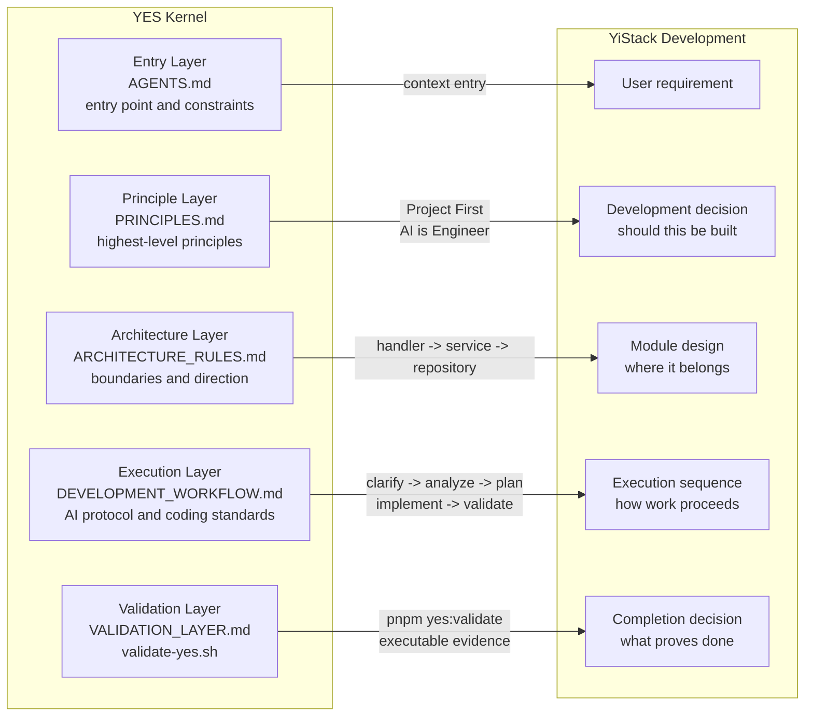

# YES (YiStack Engineering Specification)

[Simplified Chinese](YES.md) | [**English**](YES.en.md)

> This is an English translation. If the two versions differ, the Chinese
> version is authoritative.
>
> YES is YiStack's engineering specification and execution system for:
>
> - human developers;
> - AI executors;
> - the YiStack automation engine.

---

## 1. What YES Is

YES is no longer only a collection of documents. It is an engineering kernel
formed by three capabilities:

- `Specification` defines principles, architecture, workflows, and standards.
- `Execution` defines the protocols that development work must follow.
- `Validation` verifies compliance and provides completion gates.

YES can constrain YiStack development only when all three capabilities are
present. Otherwise, it is merely advisory documentation.

## 2. Goals

YES addresses recurring engineering failures:

- development steps are skipped or performed out of order;
- AI changes code based on guesses instead of evidence;
- architecture boundaries, state machines, defaults, and configuration sources drift;
- tasks lack consistent completion and validation criteria;
- users cannot see the real phase, current task, blocking reason, or next action;
- users must repeatedly approve small tasks after already approving the overall plan.

Its goal is not to replace development, but to make development:

- consistent;
- executable;
- verifiable;
- observable;
- continuously progressive;
- evolvable.

## 3. Five Layers of the YES Engineering Kernel

### 3.1 Entry Layer

The Entry Layer defines the repository entry point, reading order, and hard
constraints:

- `AGENTS.md`

### 3.2 Principle Layer

The Principle Layer defines the highest-level constraints, value ordering, and
engineering baseline:

- `docs/engineering/PRINCIPLES.en.md`

### 3.3 Architecture Layer

The Architecture Layer defines module boundaries, call direction, state
ownership, and cross-layer constraints:

- `docs/engineering/ARCHITECTURE_RULES.md`
- `docs/ARCHITECTURE.en.md`

### 3.4 Execution Layer

The Execution Layer defines the workflows, protocols, and coding rules followed
by humans and AI:

- `docs/engineering/YES_BOOTSTRAP_FRAMEWORK.md`
- `docs/engineering/DEVELOPMENT_WORKFLOW.en.md`
- `docs/engineering/AI_DEVELOPMENT_PROTOCOL.md`
- `docs/engineering/CODING_STANDARD.md`

`YES_BOOTSTRAP_FRAMEWORK.md` defines Project Foundation, historically called
Bootstrap Design.

### 3.5 Validation Layer

The Validation Layer defines minimum gates, evidence requirements, and
executable validation entry points:

- `docs/engineering/VALIDATION_LAYER.md`
- `scripts/validate-yes.sh`

Configuration-source governance is a hard Validation Layer constraint.
`.env.example` may expose only bootstrap configuration. Runtime policy,
business limits, LLM providers, container policy, and Capability, Skill, or MCP
execution policy must live in admin configuration, a database source of truth,
or controlled secret storage. YES gates prevent those boundaries from
regressing.

## 4. What Is Outside the YES Kernel

The following documents are governed by YES but are not part of the kernel:

- `docs/roadmap/ROADMAP.en.md`
- `docs/CHANGELOG.en.md`

They belong to the Planning and Delivery layers. They answer what should happen
next, what has shipped, and how product-level work is sequenced. They do not
define the engineering specification itself.

## 5. Current Implementation

The current status of YES v2 is:

- `Specification`: documented.
- `Execution`: documented and applied to real development, CI, and release workflows.
- `Validation`: aggregated under `pnpm yes:validate`, covering architecture contracts, state consistency, database baselines, project-level build/test/lint, security auditing, and browser acceptance.
- `Productization`: partially complete. Foundation, workflow phases, durable jobs, SSE recovery, and visible state are in the product, but YES is not yet an independent general-purpose policy engine.

YES is therefore more than documentation. It can block changes that violate
engineering contracts and requires reproducible completion evidence. The next
step is to move more repository-level rules into declarative, composable
product capabilities.

## 6. Relationship Between YES and YiStack

The current relationship must remain explicit:

- **YES** is primarily an engineering system with some productized capabilities.
- **YiStack** is the running software system.

In practice:

- YES defines engineering principles, architecture boundaries, execution protocols, and validation gates.
- YiStack provides projects, containers, terminals, generation, previews, Git, administration, and collaboration.
- YiStack is the system; YES is the engineering system that governs it.

YES must not yet be described as a fully independent engineering product.

## 7. Remaining Productization Gaps

YiStack already implements Foundation, workflow phases, durable Generation
Jobs, SSE replay, project-level quality gates, and browser acceptance. To make
YES a reusable engineering system, the following capabilities still need work:

1. `Task Orchestration Layer`
   - Generalize the current generation workflow across development, release, and runtime feedback.
   - Support declarative dependencies, pause conditions, recovery policies, and approval points.
2. `Engineering State Layer`
   - Unify task, validation, release, and runtime state on top of the existing workflow state.
   - Establish a consistent source of truth across processes and pages.
3. `Execution Transparency Layer`
   - Extend current generation progress into complete task lists, blockers, evidence, and next actions.
4. `Policy & Gate Layer`
   - Evolve script-based gates into declarative, composable, project-configurable policy.
5. `Validation Automation Layer`
   - Expand cross-stack adapters, benchmarks, and regression-evidence management.
6. `Release & Delivery Layer`
   - Unify versioning, release, deployment, and rollback orchestration on top of existing Git and deployment adapters.
7. `Runtime Feedback Layer`
   - Integrate post-deployment monitoring, error feedback, and release inspection.
8. `Iteration Loop Layer`
   - Feed new requirements and production issues, with evidence, into the next engineering loop.

These are directions beyond the current implementation and must not be
presented as shipped until their implementation and gates exist.

## 8. How to Use YES Today

Use YES as YiStack's engineering specification kernel:

- apply it to both human and AI development;
- use YiStack to productize more YES validation, orchestration, and delivery capabilities;
- expose YES phases, tasks, and blockers to users as product state.

For a new project, major domain, or high-rework-risk task, run Project
Foundation before detailed planning and MVP implementation:

- `docs/engineering/YES_BOOTSTRAP_FRAMEWORK.md`

It establishes:

- which engineering foundations require an immediate decision;
- which capabilities may be deferred but need boundaries now;
- which capabilities may be postponed only with a recorded reason and follow-up entry point.

Its core execution rule is:

- small tasks under an approved plan progress automatically;
- execution pauses only for important decisions, risks, requirement conflicts, or gate failures;
- users should not need to repeatedly enter "continue" for consecutive tasks in the same approved plan.

In short:

- **Now**: YiStack follows YES.
- **Next**: YiStack progressively productizes YES as an Engineering Kernel subsystem.

### 8.1 Mapping the Five Layers to YiStack

The following diagram shows how the YES Engineering Kernel maps to development
decisions and task progression. It is not a replacement for the product
architecture diagram.

## 9. Current Validation Boundary

The Validation Layer:

- provides the unified `pnpm yes:validate` entry point;
- defines validation requirements before task completion;
- requires runtime evidence for runtime failures;
- requires automated regression coverage for important behavior;
- combines TypeScript, lint, production build, Go tests, database baselines, dependency auditing, and Playwright acceptance in CI.

For users, validation must also expose:

- the real current phase;
- the real current task;
- completed and active work;
- the current blocker and next action.

Current automated gates cover:

- static architecture and critical-behavior contracts;
- consistency across bilingual public docs, product boundaries, and release material;
- key workflow, durable-job, file-operation, and collaboration invariants;
- the `.env.example` bootstrap boundary and the `system_config` / `backend/init.sql` initialization source of truth;
- clean checkout, dependency security, credential, and privacy scans;
- real database baselines and desktop/mobile browser acceptance.

Remaining validation work includes:

- general AST- and dependency-graph-level architecture enforcement;
- declarative state-machine and policy registration;
- unified evidence for secret storage, runtime reload, and cross-process configuration refresh;
- composable gates for more technology stacks, deployment providers, and post-release runtime feedback.

These remain future YES evolution work, not shipped claims.
