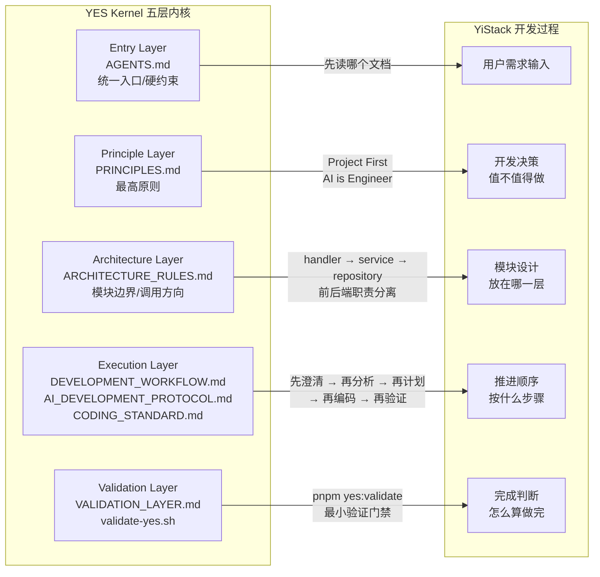

# YES (YiStack Engineering Specification)

> YES 是 YiStack 的工程规范与执行体系。
>
> 它面向三类对象：
>
> - 人类开发者
> - AI 执行者
> - YiStack 自动化引擎

---

## 1. YES 是什么

YES 不再只是一组文档，而是一套工程内核。

它由三个能力共同组成：

- `Specification`：定义原则、架构、流程、标准
- `Execution`：规定开发时必须遵守的执行协议
- `Validation`：检查规范是否被遵守，并为任务收尾提供验证门禁

当这三个能力同时存在时，YES 才能真正约束 YiStack 的开发，而不是停留在“建议集合”。

## 2. YES 的目标

YES 解决的是以下问题：

- 开发顺序容易跳步
- AI 容易凭猜测修改代码
- 架构边界、状态机、默认值、配置源容易漂移
- 任务完成后缺少一致的验证与收尾标准
- 用户看不到 AI 当前真实处于哪个阶段、正在执行哪个任务、为什么阻塞、下一步是什么
- 用户在计划已经明确后，仍需要反复输入“继续”才能推进已批准的小任务

因此，YES 的目标不是替代开发，而是让开发具备：

- 一致性
- 可执行性
- 可验证性
- 可感知性
- 可连续推进性
- 可演进性

## 3. YES Engineering Kernel 的五层结构

### 3.1 Entry Layer

入口层定义进入仓库开发时的总入口、阅读顺序和硬约束。

- `AGENTS.md`

### 3.2 Principle Layer

原则层定义最高约束、价值排序和工程底线。

- `docs/engineering/PRINCIPLES.md`

### 3.3 Architecture Layer

架构层定义模块边界、调用方向、状态职责和跨层约束。

- `docs/engineering/ARCHITECTURE_RULES.md`
- `ARCHITECTURE.md`（描述性架构文档，若存在）

### 3.4 Execution Layer

执行层定义人类与 AI 在实际开发中必须遵守的流程、协议和编码规则。

- `docs/engineering/YES_BOOTSTRAP_FRAMEWORK.md`（Project Foundation / 项目基础设计框架）
- `docs/engineering/DEVELOPMENT_WORKFLOW.md`
- `docs/engineering/AI_DEVELOPMENT_PROTOCOL.md`
- `docs/engineering/CODING_STANDARD.md`

### 3.5 Validation Layer

验证层定义最小验证门禁、证据要求和可执行检查入口。

- `docs/engineering/VALIDATION_LAYER.md`
- `scripts/validate-yes.sh`

配置源治理属于 Validation Layer 的硬约束：`.env.example` 只能暴露 bootstrap 配置；运行期策略、业务限制、LLM Provider、容器策略和 Capability / Skill / MCP 执行策略必须进入后台配置、数据库真源或受控 secret storage，并由 YES 门禁防止回退。

## 4. 什么不属于 YES Kernel

以下内容受 YES 约束，但不属于 YES Engineering Kernel 本体：

- `docs/roadmap/ROADMAP.md`
- `docs/CHANGELOG.md`

它们属于 Planning / Delivery 层，回答的是：

- 现在先做什么
- 完整产品应按哪些产品级长任务阶段推进
- 当前做到哪
- 当前有哪些任务和实施状态

而不是回答“工程规范本身是什么”。

## 5. 当前阶段的实现状态

当前 YES v2 的状态是：

- `Specification`：已文档化
- `Execution`：已文档化，并已用于真实任务约束
- `Validation`：已建立最小门禁与可执行入口，但仍不是完整自动化体系

这意味着 YES 已经不只是文档集合，但 Validation 仍需继续演进。

## 6. YES 与 YiStack 的当前定位

当前阶段，YES 与 YiStack 的关系应明确区分：

- **YES**：以工程体系为主，带少量系统化雏形
- **YiStack**：当前真实运行的软件系统

更具体地说：

- YES 负责定义工程原则、架构边界、执行协议和验证门禁
- YiStack 负责承载项目、容器、终端、生成、预览、Git、管理端等真实能力
- 当前应理解为：**YiStack 这个系统，遵循 YES 这套工程体系**

因此，当前阶段不应把 YES 错误描述为“已经独立成型的工程系统”。

当前更准确的定性是：

- YES = 工程体系为主，带最小系统化能力
- YiStack = 遵循 YES 的主系统

## 7. YES 从体系演进为系统的能力缺口

若 YES 想从“工程体系”进一步演进为“工程系统”，当前仍缺少以下能力层：

1. `Task Orchestration Layer`
   - 让需求、分析、实现、验证、发布、上线具备可编排阶段推进能力
   - 让已批准计划下的子任务能够默认连续推进，而不是每一步都等待用户重复确认
2. `Engineering State Layer`
   - 统一表达任务状态、验证状态、发布状态、上线状态
   - 让系统和用户都能看到当前阶段、当前任务、已完成项、阻塞项和下一步
3. `Execution Transparency Layer`
   - 把任务阶段、任务清单、当前进度、阻塞原因和下一步动作以用户可理解的方式持续展示出来
4. `Policy & Gate Layer`
   - 把 YES 规则从文档约束变成自动门禁
5. `Validation Automation Layer`
   - 把验证从最小脚本提升为可组合、可阻断、可回归的检查系统
6. `Release & Delivery Layer`
   - 版本管理、发布流程、上线流程、回滚机制
7. `Runtime Feedback Layer`
   - 上线后监控、错误回流、发布后巡检
8. `Iteration Loop Layer`
   - 新需求或线上问题进入后，自动重新进入下一轮工程闭环

这些能力在当前阶段仍主要属于未来方向，而不是已实现事实。

## 8. 当前应如何使用 YES

当前阶段，正确使用 YES 的方式是：

- 把 YES 当成 YiStack 的工程规范内核
- 用 YES 约束人工与 AI 的开发行为
- 用 YiStack 去逐步内化 YES 的验证、编排和交付能力
- 用 YiStack 逐步把 YES 的阶段、任务和阻塞状态透明地展示给用户

对于新项目、重大新域或高返工风险任务，还应在进入正式方案和 MVP 之前，先执行 Project Foundation（历史别名：Bootstrap Design）：

- `docs/engineering/YES_BOOTSTRAP_FRAMEWORK.md`

它负责回答：

- 哪些工程基础能力必须先决策
- 哪些能力可以后做但现在必须预留边界
- 哪些能力本轮可以暂缓，但必须登记原因与后续入口

其中一条关键执行原则应明确为：

- **已批准计划下的小任务默认自动推进**
- **只有关键决策点、风险点、需求分歧或门禁阻断时才暂停并请求用户确认**
- **用户不应为同一批准计划下的连续子任务反复输入“继续”**

也就是说：

- **现在**：先让 YiStack 遵循 YES
- **未来**：再让 YES 逐步产品化、系统化，内化为 YiStack 的 Engineering Kernel 子系统

### 8.1 YES 五层内核与 YiStack 的映射关系（目标表达）

下图用于表达 YES Engineering Kernel 如何映射到 YiStack 的开发决策与推进过程。

它的作用不是替代具体产品架构图，而是帮助统一理解：

- YES 各层分别约束什么
- YiStack 开发时哪些决策由哪一层负责约束
- YES 如何作为 YiStack 的工程规范内核发挥作用

## 9. Validation 的当前边界

当前阶段，Validation Layer 的职责是：

- 提供最小静态验证入口
- 规定任务收尾前的验证要求
- 要求运行时问题提供真实证据
- 要求关键行为变化做最小回归验证

但 YES 若要真正改善用户体验，不能只满足“开发者知道自己做到哪”，还必须逐步做到：

- 用户能看到当前真实阶段
- 用户能看到当前真实任务
- 用户能看到哪些任务已完成、哪些正在进行
- 用户能看到当前阻塞点与下一步动作

当前阶段，Validation Layer 还没有完全实现：

- 自动架构边界扫描
- 自动文档同步检查
- 自动状态机一致性检查
- 自动配置源漂移扫描已覆盖 `.env.example` bootstrap 边界和 `system_config` / `backend/init.sql` 单一初始化真源同步；后续仍需继续扩展到 secret storage 加密、运行时 reload evidence 和跨进程配置刷新
- 全量 CI 门禁

这些属于 YES 后续演进方向，而不是当前已经实现的事实。
